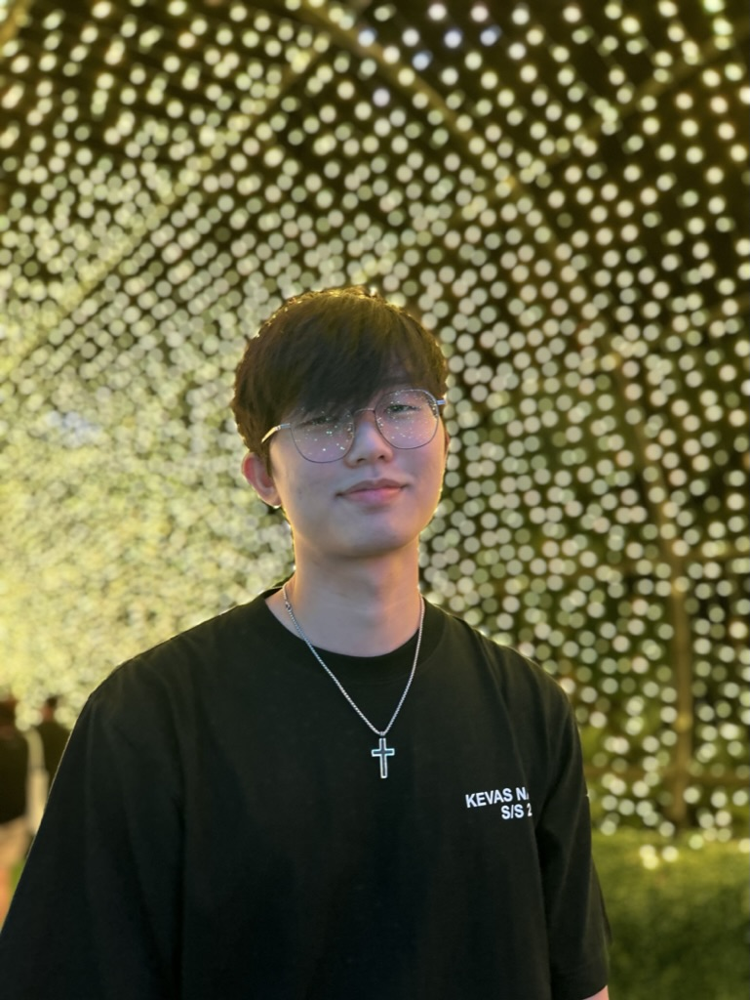
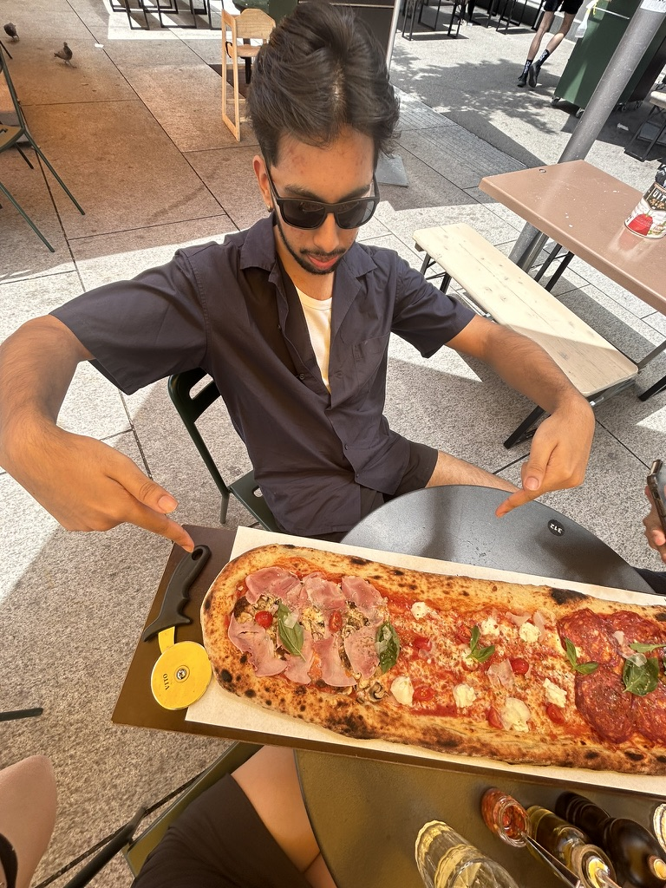

We are a team based in the [School of Computing, National University of Singapore](https://www.comp.nus.edu.sg).

You can reach us at the email `seer[at]comp.nus.edu.sg`

## TenantTrack

### Ong Qi An

[[homepage](https://www.linkedin.com/in/ong-qi-an-174703300/)]
[[github](https://github.com/blobfish465)]
[[portfolio](team/QiAn.md)]

* Role: Scheduling and tracking

### Namit Deb

[[homepage](www.linkedin.com/in/namitdeb739)]
[[github](https://github.com/namitdeb739)]
[[portfolio](team/namitdeb739.md)]

* Role: Documentation

### Jane Doe

[[github](http://github.com/johndoe)]
[[portfolio](team/QiAn)]

* Role: Team Lead
* Responsibilities: UI

### Johnny Doe

[[github](http://github.com/johndoe)] [[portfolio](team/QiAn)]

* Role: Developer
* Responsibilities: Data

### Jean Doe

[[github](http://github.com/johndoe)]
[[portfolio](team/QiAn)]

* Role: Developer
* Responsibilities: Dev Ops + Threading

### Huan Kiat

[[homepage](https://www.linkedin.com/in/huan-kiat-lim-560069345/)]
[[github](http://github.com/Huan-Kiat)]
[[portfolio](team/HuanKiat.md)]

* Role: Code Quality
