* Table of Contents
{:toc}

--------------------------------------------------------------------------------------------------------------------

## **Acknowledgements**

* The TenantTrack application is adapted from the SE-EDU AddressBook-Level3 project.
* Architecture patterns, component structuring, and some utility functions were inspired by the original project.
* Code and documentation references were derived and modified from AddressBook-Level3 (UG, DG).
* New features like archiving, filtering, and payment tracking were implemented independently to suit the
  landlord-tenant management domain.

--------------------------------------------------------------------------------------------------------------------

## **Key Updates in Implementation**

### Replaced Domain Entity

* Replaced `Person` with `Tenant`.
* The `AddressBook` class is replaced by `TenantTracker`.
* Model classes like `Tenant`, `Name`, `Phone`, `Email`, and `Address` are customized for rental contact management.

### Newly Added Features (Commands)

* **`archive`**: Archive a tenant record.
* **`unarchive`**: Unarchive a previously archived tenant.
* **`togglearchive`**: Toggle the archive status of a tenant.
* **`paid`**: Mark a tenant as having paid their rent with an icon.
* **`unpaid`**: Mark a tenant as not having paid their rent by removing the paid icon.
* **`filter`**: Filter tenants based on address.
* **`map`**: View tenants or properties on a map UI (implementation inferred from `MapCommand`).

Each of these has corresponding command classes and parsers in `logic.commands` and `logic.parser` respectively.

--------------------------------------------------------------------------------------------------------------------

## **Setting up, getting started**

Refer to the guide [_Setting up and getting started_](SettingUp.md).

--------------------------------------------------------------------------------------------------------------------

## **Design**

<div markdown="span" class="alert alert-primary">

:bulb: **Tip:** The `.puml` files used to create diagrams in this document `docs/diagrams` folder. Refer to the [
_PlantUML Tutorial_ at se-edu/guides](https://se-education.org/guides/tutorials/plantUml.html) to learn how to create
and edit diagrams.
</div>

### Architecture

<div style="text-align: center;">
    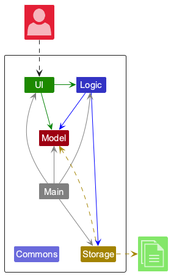
</div>

The _**Architecture Diagram**_ given above explains the high-level design of the App.

Given below is a quick overview of main components and how they interact with each other.

**Main components of the architecture**

**`Main`** (consisting of
classes [`Main`](https://github.com/se-edu/addressbook-level3/tree/master/src/main/java/seedu/address/Main.java)
and [`MainApp`](https://github.com/se-edu/addressbook-level3/tree/master/src/main/java/seedu/address/MainApp.java)) is
in charge of the app launch and shut down.

* At app launch, it initializes the other components in the correct sequence, and connects them up with each other.
* At shut down, it shuts down the other components and invokes cleanup methods where necessary.

The bulk of the app's work is done by the following four components:

* [**`UI`**](#ui-component): The UI of the App.
* [**`Logic`**](#logic-component): The command executor.
* [**`Model`**](#model-component): Holds the data of the App in memory.
* [**`Storage`**](#storage-component): Reads data from, and writes data to, the hard disk.

[**`Commons`**](#common-classes) represents a collection of classes used by multiple other components.

**How the architecture components interact with each other**

The _Sequence Diagram_ below shows how the components interact with each other for the scenario where the user issues
the command `delete 1`.

<div style="text-align: center;">
    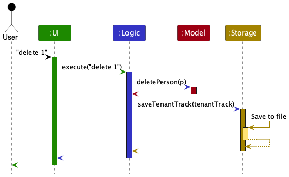
</div>

Each of the four main components (also shown in the diagram above),

* defines its _API_ in an `interface` with the same name as the Component.
* implements its functionality using a concrete `{Component Name}Manager` class (which follows the corresponding
  API `interface` mentioned in the previous point.

For example, the `Logic` component defines its API in the `Logic.java` interface and implements its functionality using
the `LogicManager.java` class which follows the `Logic` interface. Other components interact with a given component
through its interface rather than the concrete class (reason: to prevent outside component's being coupled to the
implementation of a component), as illustrated in the (partial) class diagram below.

<div style="text-align: center;">
    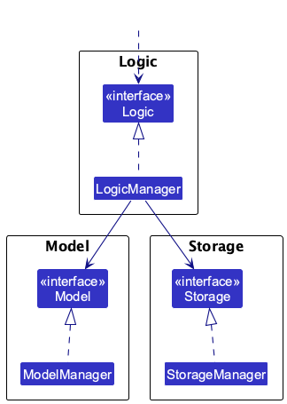
</div>

The sections below give more details of each component.

### UI component

The **API** of this component is specified
in [`Ui.java`](https://github.com/AY2425S2-CS2103T-W12-1/tp/blob/master/src/main/java/seedu/address/ui/Ui.java)

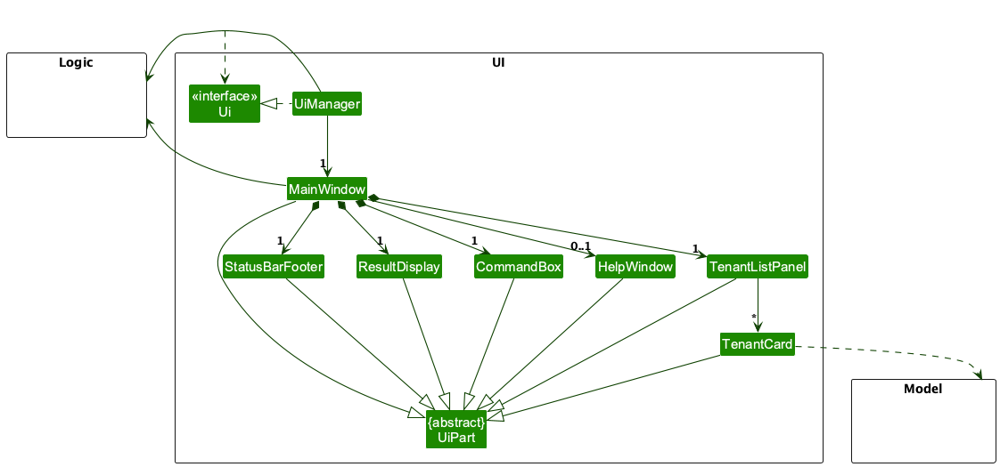

The UI consists of a `MainWindow` that is made up of parts
e.g.`CommandBox`, `ResultDisplay`, `TenantListPanel`, `StatusBarFooter` etc. All these, including the `MainWindow`,
inherit from the abstract `UiPart` class which captures the commonalities between classes that represent parts of the
visible GUI.

The `UI` component uses the JavaFx UI framework. The layout of these UI parts are defined in matching `.fxml` files that
are in the `src/main/resources/view` folder. For example, the layout of
the [`MainWindow`](https://github.com/AY2425S2-CS2103T-W12-1/tp/blob/master/src/main/java/seedu/address/ui/MainWindow.java)
is specified
in [`MainWindow.fxml`](https://github.com/AY2425S2-CS2103T-W12-1/tp/blob/master/src/main/resources/view/MainWindow.fxml)

The `UI` component,

* executes user commands using the `Logic` component.
* listens for changes to `Model` data so that the UI can be updated with the modified data.
* keeps a reference to the `Logic` component, because the `UI` relies on the `Logic` to execute commands.
* depends on some classes in the `Model` component, as it displays `Person` object residing in the `Model`.

### Logic component

**API** : [`Logic.java`](https://github.com/AY2425S2-CS2103T-W12-1/tp/blob/master/src/main/java/seedu/address/logic/Logic.java)

Here's a (partial) class diagram of the `Logic` component:

<div style="text-align: center;">
    
</div>

The sequence diagram below illustrates the interactions within the `Logic` component, taking `execute("delete 1")` API.
call as an example.


<div markdown="span" class="alert alert-info">:information_source: **Note:** The lifeline for `DeleteCommandParser` should end at the destroy marker (X) but due to a limitation of PlantUML, the lifeline continues till the end of diagram.
</div>

How the `Logic` component works:

1. When `Logic` is called upon to execute a command, it is passed to an `TenantTrackerParser` object which in turn creates
   a parser that matches the command (e.g., `DeleteCommandParser`) and uses it to parse the command.
1. This results in a `Command` object (more precisely, an object of one of its subclasses e.g., `DeleteCommand`) which
   is executed by the `LogicManager`.
1. The command can communicate with the `Model` when it is executed (e.g. to delete a person).<br>
   Note that although this is shown as a single step in the diagram above (for simplicity), in the code it can take
   several interactions (between the command object and the `Model`) to achieve.
1. The result of the command execution is encapsulated as a `CommandResult` object which is returned back from `Logic`.

Here are the other classes in `Logic` (omitted from the class diagram above) that are used for parsing a user command:

<div style="text-align: center;">
    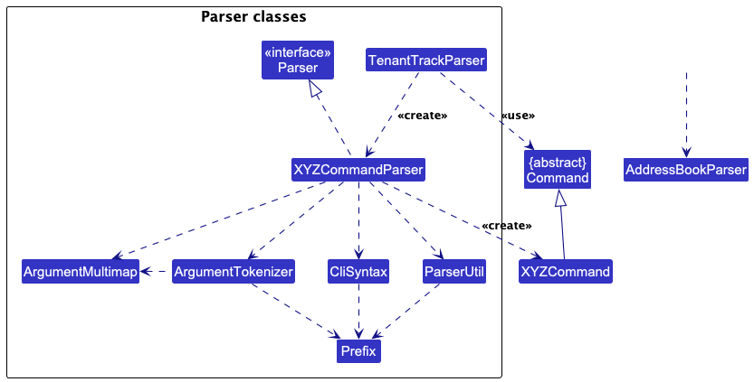
</div>

How the parsing works:

* When called upon to parse a user command, the `TenantTrackerParser` class creates an `XYZCommandParser` (`XYZ` is a
  placeholder for the specific command name e.g., `AddCommandParser`) which uses the other classes shown above to parse
  the user command and create a `XYZCommand` object (e.g., `AddCommand`) which the `TenantTrackerParser` returns back as
  a `Command` object.
* All `XYZCommandParser` classes (e.g., `AddCommandParser`, `DeleteCommandParser`, ...) inherit from the `Parser`
  interface so that they can be treated similarly where possible e.g, during testing.

### Model component

**API** : [`Model.java`](https://github.com/AY2425S2-CS2103T-W12-1/tp/blob/master/src/main/java/seedu/address/model/Model.java)

<div style="text-align: center;">
    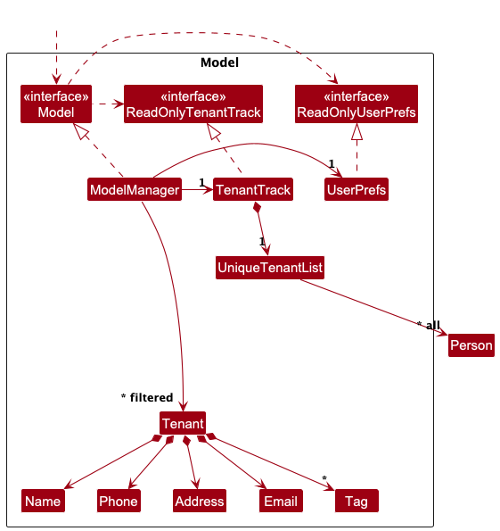
</div>

The `Model` component,

* stores the tenant tracker data i.e., all `Tenant` objects (which are contained in a `UniqueTenantList` object).
* stores the currently 'selected' `Tenant` objects (e.g., results of a search query) as a separate _filtered_ list which
  is exposed to outsiders as an unmodifiable `ObservableList<Tenant>` that can be 'observed' e.g. the UI can be bound to
  this list so that the UI automatically updates when the data in the list change.
* stores a `UserPref` object that represents the user’s preferences. This is exposed to the outside as
  a `ReadOnlyUserPref` objects.
* does not depend on any of the other three components (as the `Model` represents data entities of the domain, they
  should make sense on their own without depending on other components)

<div markdown="span" class="alert alert-info">:information_source: **Note:** An alternative (arguably, a more OOP) model is given below. It has a `Tag` list in the `TenantTracker`, which `Tenant` references. This allows `TenantTracker` to only require one `Tag` object per unique tag, instead of each `Tenant` needing their own `Tag` objects.<br>clear
<!-- <div style="text-align: center;"> -->
clear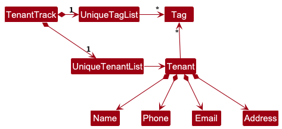
<!-- </div> -->

</div>

### Storage component

**API** : [`Storage.java`](https://github.com/AY2425S2-CS2103T-W12-1/tp/blob/master/src/main/java/seedu/address/storage/Storage.java)

<div style="text-align: center;">
    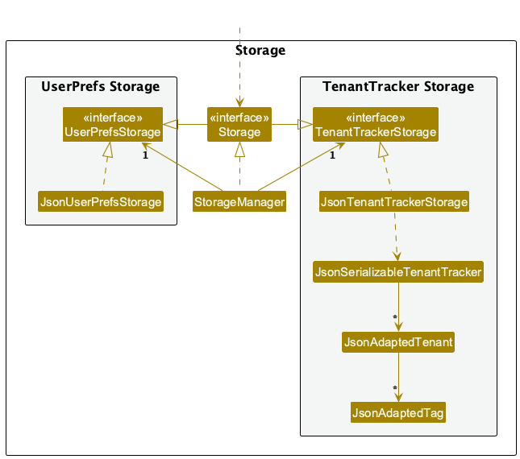
</div>

The `Storage` component,

* can save both tenant tracker data and user preference data in JSON format, and read them back into corresponding
  objects.
* inherits from both `TenantTrackerStorage` and `UserPrefStorage`, which means it can be treated as either one (if only
  the functionality of only one is needed).
* depends on some classes in the `Model` component (because the `Storage` component's job is to save/retrieve objects
  that belong to the `Model`)

### Common classes

Classes used by multiple components are in the `seedu.address.commons` package.

--------------------------------------------------------------------------------------------------------------------

## **Implementation**

This section describes some noteworthy details on how certain features are implemented.

### Archive/Unarchive/Toggle Archive Tenants

#### Implementation

The `ArchiveCommand`, `UnarchiveCommand`, and `ToggleArchiveCommand` allow users to manage the archive status of tenants. These commands are useful for landlords who want to retain historical records of tenants without cluttering the active tenant list.

* The `ArchiveCommand` marks a tenant as archived.
* The `UnarchiveCommand` restores a previously archived tenant to the active list.
* The `ToggleArchiveCommand` switches between displaying archived and active tenants in the tenant list.

These commands are implemented as part of the `Command` hierarchy. They interact with the `Model` component to update or retrieve the `Tenant`'s `isArchived` property.

#### Key Classes and Methods

* **`ArchiveCommand`**:
  * Executes the archive operation.
  * Implements the `Command` interface.
  * Contains the tenant index to be archived.

* **`UnarchiveCommand`**:
  * Executes the unarchive operation.
  * Implements the `Command` interface.
  * Contains the tenant index to be unarchived.

* **`ToggleArchiveCommand`**:
  * Toggles the display between archived and active tenants.
  * Implements the `Command` interface.

* **`ArchiveCommandParser`**:
  * Parses user input to create an `ArchiveCommand` object.

* **`UnarchiveCommandParser`**:
  * Parses user input to create an `UnarchiveCommand` object.

* **`Model`**:
  * Provides the `archiveTenant()`, `unarchiveTenant()`, and `toggleArchiveView()` methods to update or retrieve the `Tenant`'s `isArchived` property.

* **`Tenant`**:
  * Contains the `BooleanProperty isArchived` field, which is updated when a tenant is archived or unarchived.

---

#### How It Works

1. **User Input**:
   * For `ArchiveCommand`: The user enters a command like `archive 3` to archive the 3rd tenant in the displayed list.
   * For `UnarchiveCommand`: The user enters a command like `unarchive 2` to unarchive the 2nd tenant in the archived list.
   * For `ToggleArchiveCommand`: The user enters a command like `togglearchive` to switch between viewing archived and active tenants.

1. **Parsing**:
   * The `ArchiveCommandParser` parses the input and creates an `ArchiveCommand` object with the specified tenant index.
   * The `UnarchiveCommandParser` parses the input and creates an `UnarchiveCommand` object with the specified tenant index.
   * The `ToggleArchiveCommand` does not require arguments and is created directly.

1. **Execution**:
   * The `ArchiveCommand` retrieves the tenant from the `Model` using the index and updates the `isArchived` property to `true` by calling `Model#archiveTenant()`.
   * The `UnarchiveCommand` retrieves the tenant from the archived list in the `Model` using the index and updates the `isArchived` property to `false` by calling `Model#unarchiveTenant()`.
   * The `ToggleArchiveCommand` switches the view between archived and active tenants by calling `Model#toggleArchiveView()`.

1. **Feedback**:
   * A success message is displayed to the user, confirming the operation.

---

#### Example Usage Scenarios

1. **ArchiveCommand**:
   * The user enters the command `archive 3`.
   * The `Logic` component passes the command to the `TenantTrackerParser`, which uses the `ArchiveCommandParser` to parse the input.
   * The `ArchiveCommand` is created with the index `3` and executed by the `LogicManager`.
   * The `ArchiveCommand` calls `Model#archiveTenant()` to update the `isArchived` property of the 3rd tenant.
   * The UI updates to reflect the change, and a success message is displayed.

1. **UnarchiveCommand**:
   * The user enters the command `unarchive 2`.
   * The `Logic` component passes the command to the `TenantTrackerParser`, which uses the `UnarchiveCommandParser` to parse the input.
   * The `UnarchiveCommand` is created with the index `2` and executed by the `LogicManager`.
   * The `UnarchiveCommand` calls `Model#unarchiveTenant()` to update the `isArchived` property of the 2nd tenant.
   * The UI updates to reflect the change, and a success message is displayed.

1. **ToggleArchiveCommand**:
   * The user enters the command `togglearchive`.
   * The `Logic` component directly creates the `ToggleArchiveCommand` and executes it.
   * The `ToggleArchiveCommand` calls `Model#toggleArchiveView()` to switch the view between archived and active tenants.
   * The UI updates to reflect the change.

---

#### Sequence Diagram

The following sequence diagram shows how the `archive` command is executed:


The following sequence diagram shows how the `unarchive` command is executed:

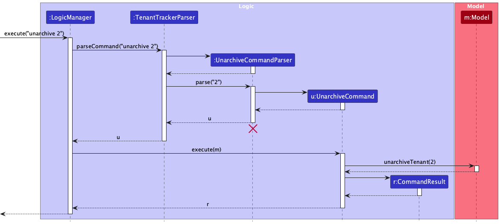

The following sequence diagram shows how the `togglearchive` command is executed:

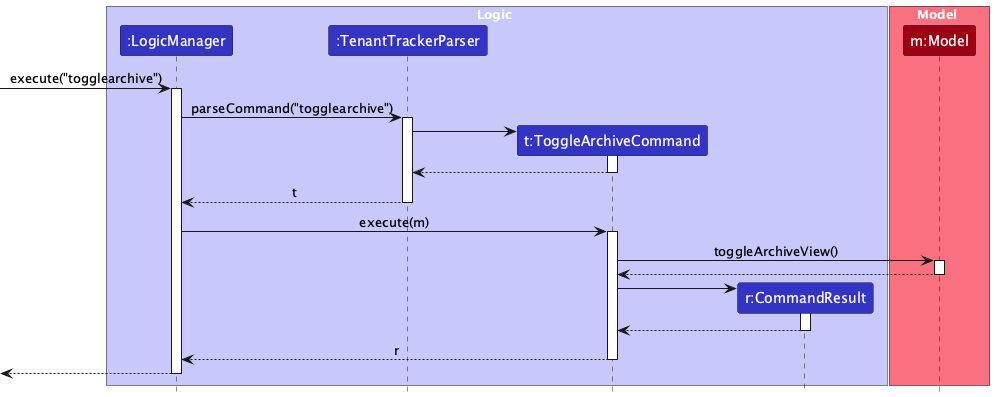

---

#### Design Considerations

**Aspect: How the archive/unarchive/toggle operations are implemented**

* **Alternative 1 (current choice)**: Use a `BooleanProperty isArchived` in the `Tenant` class.
  * **Pros**: Simple to implement and integrates well with the existing `Tenant` model.
  * **Cons**: Requires filtering logic in the UI to hide archived tenants.

* **Alternative 2**: Move archived tenants to a separate list.
  * **Pros**: Clearly separates active and archived tenants.
  * **Cons**: Increases complexity in managing multiple lists and commands.

---

#### Command Formats

```txt
archive INDEX
```

* **INDEX**: The index of the tenant in the displayed list to be archived.

```txt
unarchive INDEX
```

* **INDEX**: The index of the tenant in the displayed list to be unarchived.

```txt
togglearchive
```

* Toggles the view between archived and active tenants.

**Examples**

```txt
archive 3
```

* Archives the 3rd tenant in the displayed list.

```txt
unarchive 2
```

* Unarchives the 2nd tenant in the archived list.

```txt
togglearchive
```

* Switches the view between archived and active tenants.

**Notes**

* Archived tenants are hidden from the default tenant list but can be accessed using the `togglearchive` command.
* The `isArchived` property ensures that the tenant's data is retained for future reference.
* The `togglearchive` command does not modify any tenant data; it only changes the view.

### Paid/Unpaid Tenants

#### Implementation

The `PaidCommand` and `UnpaidCommand` allow users to manage the payment status of tenants. These commands are useful for landlords who want to track which tenants have paid their rent and which have not.

* The `PaidCommand` marks a tenant as paid.
* The `UnpaidCommand` marks a tenant as unpaid.

These commands are implemented as part of the `Command` hierarchy. They interact with the `Model` component to update or retrieve the `Tenant`'s `isPaid` property.

#### Key Classes and Methods

* **`PaidCommand`**:
  * Executes the operation to mark a tenant as paid.
  * Implements the `Command` interface.
  * Contains the tenant's phone number to identify the tenant.

* **`UnpaidCommand`**:
  * Executes the operation to mark a tenant as unpaid.
  * Implements the `Command` interface.
  * Contains the tenant's phone number to identify the tenant.

* **`PaidCommandParser`**:
  * Parses user input to create a `PaidCommand` object.

* **`UnpaidCommandParser`**:
  * Parses user input to create an `UnpaidCommand` object.

* **`Model`**:
  * Provides the `markTenantAsPaid()` and `unmarkTenantAsPaid()` methods to update the `Tenant`'s `isPaid` property.

* **`Tenant`**:
  * Contains the `BooleanProperty isPaid` field, which is updated when a tenant is marked as paid or unpaid.

---

#### How It Works

1. **User Input**:
   * For `PaidCommand`: The user enters a command like `paid 98765432` to mark the tenant with the phone number `98765432` as paid.
   * For `UnpaidCommand`: The user enters a command like `unpaid 98765432` to mark the tenant with the phone number `98765432` as unpaid.

1. **Parsing**:
   * The `PaidCommandParser` parses the input and creates a `PaidCommand` object with the specified phone number.
   * The `UnpaidCommandParser` parses the input and creates an `UnpaidCommand` object with the specified phone number.

1. **Execution**:
   * The `PaidCommand` retrieves the tenant from the `Model` using the phone number and updates the `isPaid` property to `true` by calling `Model#markTenantAsPaid()`.
   * The `UnpaidCommand` retrieves the tenant from the `Model` using the phone number and updates the `isPaid` property to `false` by calling `Model#unmarkTenantAsPaid()`.

1. **Feedback**:
   * A success message is displayed to the user, confirming the operation.

---

#### Example Usage Scenarios

1. **PaidCommand**:
   * The user enters the command `paid 98765432`.
   * The `Logic` component passes the command to the `TenantTrackerParser`, which uses the `PaidCommandParser` to parse the input.
   * The `PaidCommand` is created with the phone number `98765432` and executed by the `LogicManager`.
   * The `PaidCommand` calls `Model#markTenantAsPaid()` to update the `isPaid` property of the tenant.
   * The UI updates to reflect the change, and a success message is displayed.

1. **UnpaidCommand**:
   * The user enters the command `unpaid 98765432`.
   * The `Logic` component passes the command to the `TenantTrackerParser`, which uses the `UnpaidCommandParser` to parse the input.
   * The `UnpaidCommand` is created with the phone number `98765432` and executed by the `LogicManager`.
   * The `UnpaidCommand` calls `Model#unmarkTenantAsPaid()` to update the `isPaid` property of the tenant.
   * The UI updates to reflect the change, and a success message is displayed.

---

#### Sequence Diagram

The following sequence diagram shows how the `paid` command is executed:

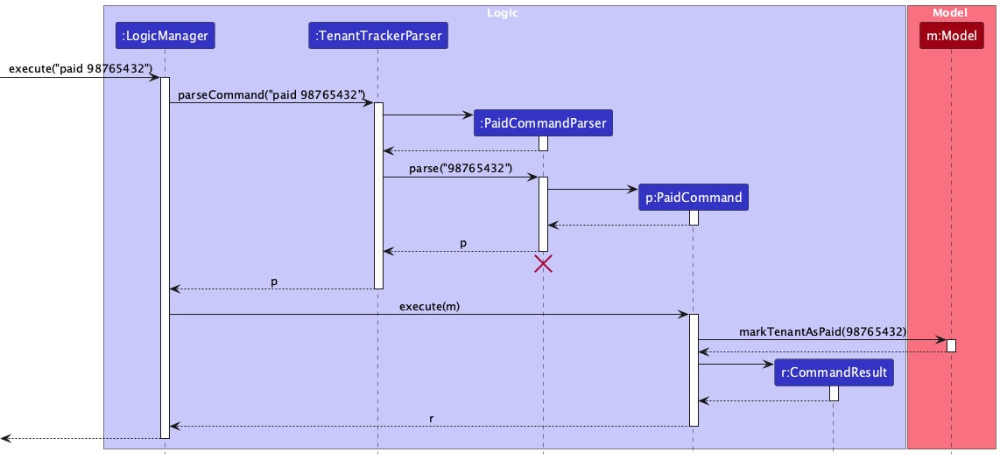

The following sequence diagram shows how the `unpaid` command is executed:

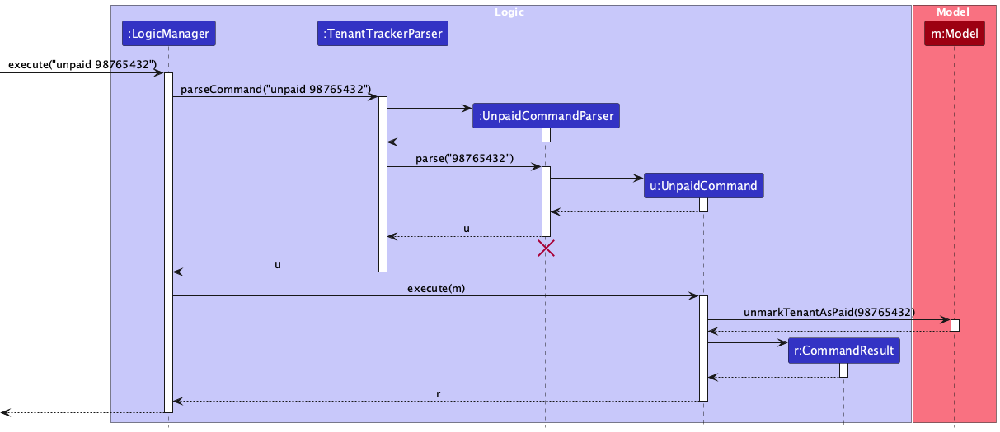

---

#### Design Considerations

**Aspect: How the paid/unpaid operations are implemented**

* **Alternative 1 (current choice)**: Use a `BooleanProperty isPaid` in the `Tenant` class.
  * **Pros**: Simple to implement and integrates well with the existing `Tenant` model.
  * **Cons**: Requires filtering logic in the UI to display tenants based on payment status.

* **Alternative 2**: Maintain separate lists for paid and unpaid tenants.
  * **Pros**: Clearly separates paid and unpaid tenants.
  * **Cons**: Increases complexity in managing multiple lists and commands.

---

#### Command Formats

```plaintext
paid PHONE
```

* **PHONE**: The phone number of the tenant to be marked as paid.

```plaintext
unpaid PHONE
```

* **PHONE**: The phone number of the tenant to be marked as unpaid.

**Examples**

```plaintext
paid 98765432
```

* Marks the tenant with the phone number `98765432` as paid.

```plaintext
unpaid 98765432
```

* Marks the tenant with the phone number `98765432` as unpaid.

**Notes**

* The phone number must belong to an existing tenant.
* If the tenant is already marked as paid or unpaid, an appropriate error message is displayed.
* The `isPaid` property ensures that the tenant's payment status is tracked accurately.

### Filter Tenants

#### Implementation

The `FilterCommand` allows users to filter tenants based on their address. This feature is useful for landlords who want to quickly identify tenants residing at specific locations.

* The `FilterCommand` filters tenants whose addresses contain the specified keywords.
* The `FilterCommandParser` parses the user input to create a `FilterCommand` object.
* The `Model` component provides the `updateFilteredTenantList()` method to apply the filtering logic.

#### Key Classes and Methods

* **`FilterCommand`**:
  * Executes the filtering operation.
  * Implements the `Command` interface.
  * Contains the filtering predicate.

* **`FilterCommandParser`**:
  * Parses user input to create a `FilterCommand` object.

* **`Model`**:
  * Provides the `updateFilteredTenantList()` method to apply the filtering logic.

* **`AddressContainsKeywordsPredicate`**:
  * Evaluates whether a tenant's address contains the specified keywords.

---

#### How It Works

1. **User Input**:
   * The user enters a command like `filter Kent Ridge` to filter tenants whose addresses contain the keywords "Kent" and "Ridge".

1. **Parsing**:
   * The `FilterCommandParser` parses the input and creates a `FilterCommand` object with an `AddressContainsKeywordsPredicate` containing the specified keywords.

1. **Execution**:
   * The `FilterCommand` calls `Model#updateFilteredTenantList()` with the predicate to filter tenants based on their addresses.

1. **Feedback**:
   * The filtered list of tenants is displayed to the user.

---

#### Search Details

* The search is **NOT** case-sensitive. For example, `Lower Kent Ridge` will match `lower kent ridge`.
* The order of the keywords does not matter. For example, `Kent Ridge Lower` will match `Lower Kent Ridge`.
* Only the **address** is searched.
* **Prefixes** of words or postal codes will be matched. For example, an address with `Kent` in it will satisfy the
  command `filter Ken` and an address with `229220` in it will satisfy the command `filter 229`.
  However, an address with `ent` in it will **NOT** satisfy the command `filter Kent`.
* Tenants with addresses matching at least one keyword will be returned (i.e. `OR` search). For
  example, `Lower Kent Ridge` will return `Lower Arab Street`, `Kent Ridge`.

---

#### Example Usage Scenarios

1. **FilterCommand**:
   * The user enters the command `filter Kent Ridge`.
   * The `Logic` component passes the command to the `TenantTrackerParser`, which uses the `FilterCommandParser` to parse the input.
   * The `FilterCommand` is created with the keywords `Kent` and `Ridge` and executed by the `LogicManager`.
   * The `FilterCommand` calls `Model#updateFilteredTenantList()` to filter tenants whose addresses contain the keywords.
   * The UI updates to display the filtered list of tenants.

---

#### Examples

* `filter Kent Ridge`:
  * Returns tenants with addresses like `Lower Kent Ridge`, `Upper Kent Ridge`, `Kent Road`, and `Ridge View`.

* `filter 229`:
  * Returns tenants with addresses containing postal codes like `229220`.

---

#### Sequence Diagram

The following sequence diagram shows how the `filter` command is executed:

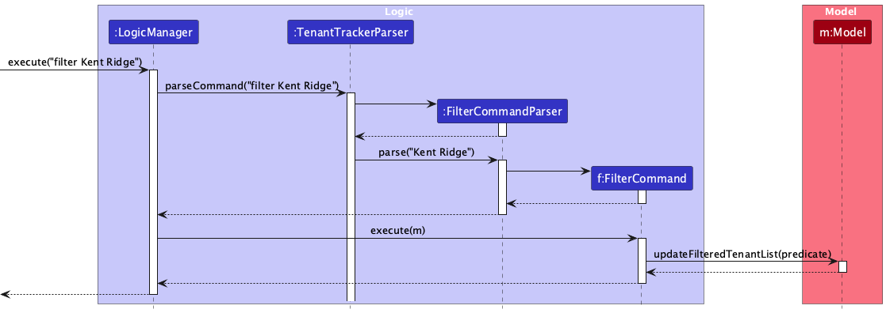

---

#### Design Considerations

**Aspect: How the filtering operation is implemented**

* **Alternative 1 (current choice)**: Use predicates to filter the tenant list.
  * **Pros**: Simple to implement and integrates well with the existing `Model` component.
  * **Cons**: Requires careful handling of multiple keywords to ensure accurate filtering.

* **Alternative 2**: Create separate filtered lists for each keyword.
  * **Pros**: Simplifies the filtering logic for individual keywords.
  * **Cons**: Increases complexity in managing multiple lists and combining results.

---

#### Command Formats

```plaintext
filter KEYWORD [MORE_KEYWORDS]...
```

* **KEYWORD**: A keyword to match against tenant addresses.

**Examples**

```plaintext
filter Kent Ridge
```

* Filters tenants whose addresses contain the keywords "Kent" and "Ridge".

```plaintext
filter 119077
```

* Filters tenants whose addresses contain the postal code "119077".

**Notes**

* Keywords are case-insensitive.
* If no tenants match the criteria, an appropriate message is displayed.

### Map Tenants

#### Implementation

The `MapCommand` allows users to view the location of a tenant's address on Google Maps. This feature is useful for landlords who want to quickly locate a tenant's property.

* The `MapCommand` generates a Google Maps URL based on the tenant's address.
* The `MapCommandParser` parses the user input to create a `MapCommand` object.
* The `Model` component provides access to the tenant's address.

#### Key Classes and Methods

* **`MapCommand`**:
  * Executes the operation to generate and open the Google Maps URL.
  * Implements the `Command` interface.
  * Contains the tenant's index to identify the tenant.

* **`MapCommandParser`**:
  * Parses user input to create a `MapCommand` object.

* **`Model`**:
  * Provides access to the tenant's address using the tenant's index.

* **`Address`**:
  * Represents the tenant's address, which is encoded into a URL-friendly format.

---

#### How It Works

1. **User Input**:
   * The user enters a command like `map 3` to view the location of the 3rd tenant's address on Google Maps.

1. **Parsing**:
   * The `MapCommandParser` parses the input and creates a `MapCommand` object with the specified tenant index.

1. **Execution**:
   * The `MapCommand` retrieves the tenant's address from the `Model` using the index.
   * The address is URL-encoded and appended to the Google Maps base URL.
   * The generated URL is opened in the user's default web browser.

1. **Feedback**:
   * A success message is displayed to the user, confirming the operation.

---

#### Example Usage Scenarios

1. **MapCommand**:
   * The user enters the command `map 3`.
   * The `Logic` component passes the command to the `TenantTrackerParser`, which uses the `MapCommandParser` to parse the input.
   * The `MapCommand` is created with the index `3` and executed by the `LogicManager`.
   * The `MapCommand` retrieves the address of the 3rd tenant from the `Model`.
   * The address is URL-encoded, and the Google Maps URL is generated and opened in the browser.
   * A success message is displayed to the user.

---

#### Sequence Diagram

The following sequence diagram shows how the `map` command is executed:

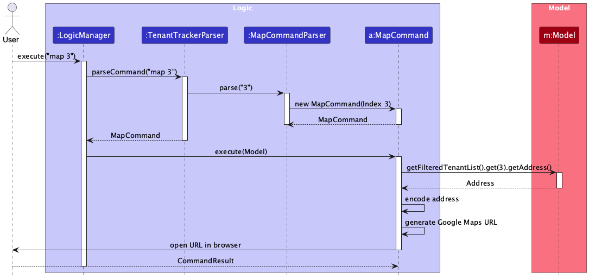

---

#### Design Considerations

**Aspect: How the map operation is implemented**

* **Alternative 1 (current choice)**: Use the tenant's address to generate a Google Maps URL.
  * **Pros**: Simple to implement and integrates well with the existing `Tenant` model.
  * **Cons**: Requires the tenant's address to be accurate and complete.

* **Alternative 2**: Use a third-party geocoding API to validate and fetch coordinates.
  * **Pros**: Ensures the address is valid and provides precise location data.
  * **Cons**: Increases complexity and introduces dependency on an external API.

---

#### Command Formats

```plaintext
map INDEX
```

* **INDEX**: The index of the tenant in the displayed list whose address will be mapped.

**Examples**

```plaintext
map 3
```

* Opens the Google Maps location of the 3rd tenant's address.

**Notes**

* The tenant's address must be valid and complete for the Google Maps URL to work.
* If the tenant's index is invalid, an appropriate error message is displayed.

### \[Proposed\] Undo/redo feature

#### Proposed Implementation

The proposed undo/redo mechanism is facilitated by `VersionedTenantTracker`. It extends `TenantTracker` with an undo/redo
history, stored internally as an `tenantTrackerStateList` and `currentStatePointer`. Additionally, it implements the
following operations:

* `VersionedTenantTracker#commit()`— Saves the current tenant tracker state in its history.
* `VersionedTenantTracker#undo()`— Restores the previous tenant tracker state from its history.
* `VersionedTenantTracker#redo()`— Restores a previously undone tenant tracker state from its history.

These operations are exposed in the `Model` interface as `Model#commitTenantTracker()`, `Model#undoTenantTracker()`
and `Model#redoTenantTracker()` respectively.

Given below is an example usage scenario and how the undo/redo mechanism behaves at each step.

Step 1. The user launches the application for the first time. The `VersionedTenantTracker` will be initialized with the
initial tenant tracker state, and the `currentStatePointer` pointing to that single tenant tracker state.

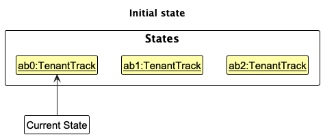

Step 2. The user executes `delete 5` command to delete the 5th person in the tenant tracker. The `delete` command
calls `Model#commitTenantTracker()`, causing the modified state of the tenant tracker after the `delete 5` command executes
to be saved in the `tenantTrackerStateList`, and the `currentStatePointer` is shifted to the newly inserted tenant tracker
state.

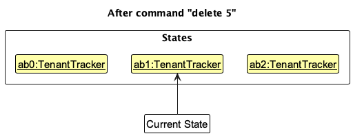

Step 3. The user executes `add givenN/David …​` to add a new person. The `add` command also
calls `Model#commitTenantTracker()`, causing another modified tenant tracker state to be saved into
the `tenantTrackerStateList`.

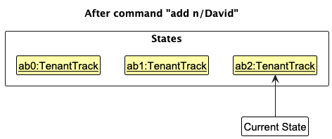

<div markdown="span" class="alert alert-info">:information_source: **Note:** If a command fails its execution, it will not call `Model#commitTenantTracker()`, so the tenant tracker state will not be saved into the `tenantTrackerStateList`.

</div>

Step 4. The user now decides that adding the person was a mistake, and decides to undo that action by executing
the `undo` command. The `undo` command will call `Model#undoTenantTracker()`, which will shift the `currentStatePointer`
once to the left, pointing it to the previous tenant tracker state, and restores the tenant tracker to that state.

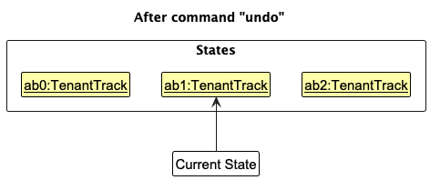

<div markdown="span" class="alert alert-info">:information_source: **Note:** If the `currentStatePointer` is at index 0, pointing to the initial `TenantTracker` state, then there are no previous `TenantTracker` states to restore. The `undo` command uses `Model#canUndoTenantTracker()` to check if this is the case. If so, it will return an error to the user rather
than attempting to perform the undo.

</div>

The following sequence diagram shows how an undo operation goes through the `Logic` component:

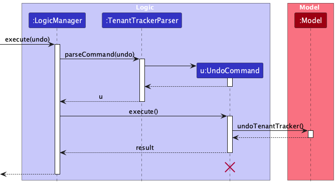

<div markdown="span" class="alert alert-info">:information_source: **Note:** The lifeline for `UndoCommand` should end at the destroy marker (X) but due to a limitation of PlantUML, the lifeline reaches the end of diagram.

</div>

Similarly, how an undo operation goes through the `Model` component is shown below:

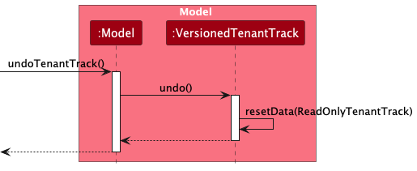

The `redo` command does the opposite — it calls `Model#redoTenantTracker()`, which shifts the `currentStatePointer` once
to the right, pointing to the previously undone state, and restores the tenant tracker to that state.

<div markdown="span" class="alert alert-info">:information_source: **Note:** If the `currentStatePointer` is at index `tenantTrackerStateList.size() - 1`, pointing to the latest tenant tracker state, then there are no undone `TenantTracker` states to restore. The `redo` command uses `Model#canRedoTenantTracker()` to check if this is the case. If so, it will return an error to the user rather than attempting to perform the redo.

</div>

Step 5. The user then decides to execute the command `list`. Commands that do not modify the tenant tracker, such
as `list`, will usually not call `Model#commitTenantTracker()`, `Model#undoTenantTracker()` or `Model#redoTenantTracker()`.
Thus, the `tenantTrackerStateList` remains unchanged.

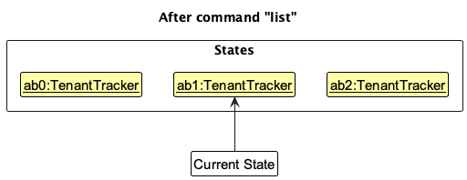

Step 6. The user executes `clear`, which calls `Model#commitTenantTracker()`. Since the `currentStatePointer` is not
pointing at the end of the `tenantTrackerStateList`, all tenant tracker states after the `currentStatePointer` will be
purged. Reason: It no longer makes sense to redo the `add givenN/David …​` command. This is the behavior that most modern
desktop applications follow.

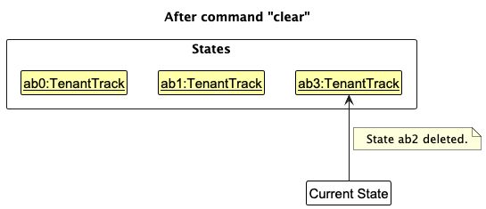

The following activity diagram summarizes what happens when a user executes a new command:

<div style="text-align: center;">
    
</div>

#### Design considerations

**Aspect: How undo & redo executes:**

* **Alternative 1 (current choice):** Saves the entire tenant tracker.
  * Pros: Easy to implement.
  * Cons: May have performance issues in terms of memory usage.

* **Alternative 2:** Individual command knows how to undo/redo by
  itself.
  * Pros: Will use less memory (e.g. for `delete`, just save the tenant being deleted).
  * Cons: We must ensure that the implementation of each individual command are correct.

--------------------------------------------------------------------------------------------------------------------

## **Documentation, logging, testing, configuration, dev-ops**

* [Documentation guide](Documentation.md)
* [Testing guide](Testing.md)
* [Logging guide](Logging.md)
* [Configuration guide](Configuration.md)
* [DevOps guide](DevOps.md)

--------------------------------------------------------------------------------------------------------------------

## **Appendix: Requirements**

### Product scope

**Target user profile**: Our target users are landlords who list their multiple properties to rent on a platform like Airbnb.

**Value proposition**: TenantTrack provides fast and efficient contact management for landlords handling multiple rental
properties. Optimized for power users who prefer a CLI, it enables quick access, organization, and retrieval of tenant
and client details, streamlining communication and reducing administrative hassle while retaining the benefits of a GUI.

### User stories

Priorities: High (must have) - `* * *`, Medium (nice to have) - `* *`, Low (unlikely to have) - `*`

| Priority | As a …​                                        |  I want to …​                                                   | So that I can…​                                                                  |
|----------|---------------------------------------------------|--------------------------------------------------------------------|----------------------------------------------------------------------------------|
| `* * *`  | Landlord                                          | list my tenants' names                                             | get in touch with them for property-related matters.                             
| `* * *`  | Landlord                                          | list my tenants' phone numbers                                     | get in touch with them for property-related matters.                             |
| `* * *`  | Landlord                                          | list my tenants' emails                                            | get in touch with them for property-related matters.                             |
| `* * *`  | Landlord                                          | list my tenants' properties                                        | get in touch with them for property-related matters.                             |
| `* * *`  | Landlord                                          | delete tenant name when a lease ends                               | keep my database current.                                                        |
| `* * *`  | Landlord                                          | delete tenant email when a lease ends                              | keep my database current.                                                        |
| `* * *`  | Landlord                                          | delete tenant contact number when a lease ends                     | keep my database current.                                                        |
| `* * *`  | Landlord                                          | delete tenant property of residence when a lease ends              | keep my database current.                                                        |
| `* * *`  | Landlord                                          | add a new tenant name                                              | record tenant's name.                                                            |
| `* * *`  | Landlord                                          | add a new tenant phone number                                      | record tenant's phone number.                                                    |
| `* * *`  | Landlord                                          | add a new tenant email                                             | record tenant's email.                                                           |
| `* * *`  | Landlord                                          | add a new tenant property                                          | record tenant's property.                                                        |
| `* *`    | Landlord                                          | sort tenants by attributes like gender                             | derive the demographics for the tenants.                                         |
| `* *`    | Landlord                                          | tag tenants with custom tags                                       | categorize and manage them effectively.                                          |
| `* *`    | Landlord                                          | update property details                                            | ensure important details like lease information can be updated.                  |
| `* *`    | Landlord                                          | export tenant contact list                                         | integrate them with external CRM or communication tools.                         |
| `* *`    | Landlord                                          | mark tenants as active or inactive                                 | distinguish between current and past tenants without deleting records.           |
| `* *`    | Landlord                                          | add multiple phone numbers or emails for a tenant                  | contact them through different channels.                                         |
| `* *`    | Landlord                                          | set a primary contact for a property with multiple tenants         | know who to reach first in case of urgent matters.                               |
| `* *`    | Landlord                                          | add a profile picture to a tenant’s contact details                | visually recognize them easily.                                                  |
| `* *`    | Landlord                                          | undo accidental deletions of contacts                              | avoid losing important information.                                              |
| `* *`    | Landlord                                          | archive past tenants instead of deleting them                      | keep historical records without cluttering my main contact list.                 |
| `* *`    | Landlord                                          | set up auto-complete for addresses                                 | enter property details faster.                                                   |
| `* *`    | Landlord                                          | retrieve an address through tenant name and phone number           | know where the tenant is staying.                                                |
| `* *`    | Landlord                                          | check for validity of tenant occupancy                             | confirm whether the tenant is legally living there.                              |
| `* *`    | Landlord                                          | retrieve lease agreements                                          | check the specifics on the agreement.                                            |
| `* *`    | Landlord                                          | retrieve addresses through tenant history                          | track who lived in which apartment over time.                                    |
| `* *`    | Landlord                                          | retrieve tenant's past rental history                              | know whether a tenant has rented with me before.                                 |
| `* *`    | Landlord                                          | import tenant contacts from a CSV file                             | quickly set up my database.                                                      |
| `*`      | Landlord of multiple properties                   | group my tenants/properties by building/neighborhood/zone          | better organize my properties and visits.                                        |
| `*`      | Landlord                                          | update tenant contact details (phone/email)                        | remain in touch with my tenants in the event their contacts change.              |
| `*`      | Landlord                                          | access analytics like total income from properties                 | better manage my personal finances.                                              |
| `*`      | Landlord                                          | see which tenants' rents are overdue or coming up in the next week | remind them to pay rent on time.                                                 |
| `*`      | Landlord with properties housing multiple people  | assign multiple tenant contacts to one property                    | contact any of the residents of a single property easily.                        |
| `*`      | Landlord with properties housing multiple people  | filter properties by occupancy status                              | access which properties are available for rent so I can list them on the market. |
| `*`      | Landlord                                          | search for a tenant's contact details by name                      | quickly get their contact to communicate with them efficiently.                  |
| `*`      | Landlord                                          | add the property a tenant is staying at to their contact details   | know which property the tenant is renting.                                       |
| `*`      | Landlord                                          | add a duration of stay to a tenant's contact detail                | effectively manage my rental scheduling.                                         |

### Use cases

(For all use cases below, the **System** is the `TenantTrack` and the **Actor** is the `user`, unless specified
otherwise)

**Use case: Add a new tenant (Create)**

**MSS**

1. Landlord requests to add a new tenant.
2. System prompts for tenant details (name, phone number, email, property, etc.).
3. Landlord enters the tenant details and confirms.
4. System saves the new tenant.

   Use case ends.

**Extensions**

* 2a. Required fields are missing.
  * 2a1. System shows an error message.

      Use case resumes at step 2.

* 3a. The tenant already exists.
  * 3a1. System shows a warning and asks for confirmation.

      Use case resumes at step 2.

---

**Use case: Search for a tenant by name (Read)**

**MSS**

1. Landlord requests to search for a tenant by name.
2. System displays matching tenant details.

   Use case ends.

**Extensions**

* 2a. No matching tenant is found.
  * 2a1. System shows an error message.

      Use case ends.

---

**Use case: Update tenant contact details (Update)**

**MSS**

1. Landlord requests to update a tenant’s contact details.
2. System displays the tenant’s current contact details.
3. Landlord updates phone number and/or email.
4. System saves the updated contact details.

   Use case ends.

**Extensions**

* 2a. The tenant does not exist.
  * 2a1. System shows an error message.

      Use case ends.

* 3a. The new contact details are in an invalid format.
  * 3a1. System shows an error message.

      Use case resumes at step 2.

---

**Use case: Delete a tenant (Delete)**

**MSS**

1. Landlord requests to delete a tenant.
2. System asks for confirmation.
3. Landlord confirms the deletion.
4. System deletes the tenant record.

   Use case ends.

**Extensions**

* 2a. The tenant does not exist.
  * 2a1. System shows an error message.

      Use case ends.

* 3a. The tenant has active lease agreements.
  * 3a1. System prevents deletion and notifies the landlord.

      Use case ends.

---

**Use case: See overdue or upcoming rent payments**

**MSS**

1. Landlord requests a list of tenants with overdue or upcoming rent payments.
2. System displays the list of tenants with due dates.

   Use case ends.

**Extensions**

* 2a. No tenants have overdue or upcoming rent.
  * 2a1. System shows a message indicating no upcoming payments.

      Use case ends.

---

**Use case: Archive a tenant**

**MSS**

1. Landlord requests to archive a tenant.
2. System archives the tenant and updates the tenant list.

   Use case ends.

**Extensions**

* 1a. The tenant does not exist.
  * 1a1. System shows an error message.

      Use case ends.

---

**Use case: Unarchive a tenant**

**MSS**

1. Landlord requests to unarchive a tenant.
2. System unarchives the tenant and updates the tenant list.

   Use case ends.

**Extensions**

* 1a. The tenant does not exist.
  * 1a1. System shows an error message.

      Use case ends.

---

**Use case: Toggle between archived and active tenants**

**MSS**

1. Landlord requests to toggle the view between archived and active tenants.
2. System switches the view.

   Use case ends.

---

**Use case: Mark a tenant as paid**

**MSS**

1. Landlord requests to mark a tenant as paid.
2. System updates the tenant's payment status to "paid".

   Use case ends.

**Extensions**

* 1a. The tenant does not exist.
  * 1a1. System shows an error message.

      Use case ends.

---

**Use case: Mark a tenant as unpaid**

**MSS**

1. Landlord requests to mark a tenant as unpaid.
2. System updates the tenant's payment status to "unpaid".

   Use case ends.

**Extensions**

* 1a. The tenant does not exist.
  * 1a1. System shows an error message.

      Use case ends.

---

**Use case: Filter tenants by address**

**MSS**

1. Landlord requests to filter tenants by address keywords.
2. System displays tenants whose addresses match the keywords.

   Use case ends.

**Extensions**

* 1a. No tenants match the filter criteria.
  * 1a1. System shows a message indicating no matches.

      Use case ends.

---

**Use case: View a tenant's address on a map**

**MSS**

1. Landlord requests to view a tenant's address on a map.
2. System generates a Google Maps URL for the tenant's address and opens it in the browser.

   Use case ends.

**Extensions**

* 1a. The tenant does not exist.
  * 1a1. System shows an error message.

      Use case ends.

* 1b. The tenant's address is invalid.
  * 1b1. System shows an error message.

      Use case ends.

### Non-Functional Requirements

1. Should work on any _mainstream OS_ as long as it has Java `17` or above installed.
1. Should be able to hold up to 1000 persons without a noticeable sluggishness in performance for typical usage.
1. A user with above average typing speed for regular English text (i.e. not code, not system admin commands) should be
   able to accomplish most of the tasks faster using commands than using the mouse.
1. The final product should be an evolution of the given codebase, with incremental changes leading to a working product
   at each step. Full code replacement is allowed if done gradually.
1. The product should cater to users who type fast and prefer keyboard input over other means of interaction.
1. The software should be a single-user application, meaning no multi-user access, shared file storage, or concurrent
   users on the same system.
1. The development process should follow a breadth-first incremental approach, ensuring consistent progress throughout
   the project duration.
1. All data should be stored locally in a human-editable text file, allowing advanced users to manipulate data directly.
1. A database management system (DBMS) should not be used to store data, encouraging object-oriented data management.
1. The software must follow the object-oriented programming (OOP) paradigm, though minor deviations for justifiable
   reasons are acceptable.
1. The application should be platform-independent, working on Windows, Linux, and macOS without relying on OS-specific
   features.
1. The software should be compatible with Java 17 and must not require any other Java version to run.
1. The application should be portable and run without requiring an installer.
1. The software should not depend on a remote server, ensuring usability even after the project ends.
1. Third-party libraries, frameworks, or services are allowed only if they are free, open-source, have permissive
   licenses, do not require user installation, and comply with all other constraints.
1. The GUI should work smoothly at standard screen resolutions (1920x1080 and above) and scale settings (100% and 125%),
   while remaining usable at 1280x720 and 150% scaling.
1. The entire application should be packaged into a single JAR file, or if necessary, a single ZIP file containing all
   required resources.
1. The deliverable file sizes should not exceed 100MB for the application and 15MB per PDF document to ensure ease of
   downloading and testing.
1. The user guide and developer guide should be PDF-friendly, avoiding expandable panels, embedded videos, and animated
   GIFs.
1. The application should be optimized for a command-line interface (CLI) first, ensuring fast command-based input for
   target users while allowing visual feedback through a GUI.
1. The product should maintain realistic use cases, targeting scenarios where a standalone desktop application is a
   viable solution.
1. The system should ensure data integrity by validating inputs and preventing invalid data from being saved.
1. The application should include automated tests to ensure high code quality and prevent regressions.
1. The software should be modular to facilitate future enhancements and maintenance.
1. The application should provide clear error messages for invalid user inputs to ensure a smooth user experience.
1. The system should recover gracefully from unexpected crashes or corrupted data files.
1. The application should include logging functionality to assist in debugging and tracking user actions.
1. The software should minimize memory usage and avoid memory leaks.
1. The application should support localization to allow easy adaptation for different languages and regions.

### Glossary

* **Address**: A tenant's location, which must include a valid 6-digit postal code.
* **Archive**: The process of marking a tenant as inactive while retaining their data for future reference.
* **CLI (Command-Line Interface)**: A text-based interface where users interact with the application by typing commands.
* **Command Box**: The input field in the GUI where users type commands to interact with the application.
* **Command Parser**: A component responsible for interpreting user input and creating corresponding command objects.
* **Filter**: A command used to narrow down the list of tenants based on specific criteria, such as address keywords.
* **GUI (Graphical User Interface)**: A visual interface that allows users to interact with the application using graphical elements like buttons and menus.
* **Human-editable file**: A text file that can be directly modified by users without requiring specialized tools.
* **Index**: A positive integer representing the position of an item in a displayed list, starting from 1.
* **JavaFX**: A software platform used to create and deliver desktop applications with a graphical user interface.
* **JSON (JavaScript Object Notation)**: A lightweight data-interchange format used to store application data.
* **Landlord**: The primary user of TenantTrack, responsible for managing multiple rental properties and tenant details.
* **Mainstream OS**: Windows, Linux, Unix, MacOS.
* **ObservableList**: A list that allows listeners to track changes to its elements, commonly used in the UI.
* **Paid Icon**: A visual indicator used to mark tenants who have paid their rent.
* **PlantUML**: A tool used to create UML diagrams for documentation purposes.
* **Private contact detail**: A contact detail that is not meant to be shared with others.
* **Property**: A rental unit or building managed by the landlord and associated with one or more tenants.
* **Rental Payment**: The periodic payment made by a tenant to the landlord for occupying a property.
* **Tag**: A label assigned to a tenant for categorization purposes.
* **Tenant**: An individual renting a property from a landlord. Each tenant has associated details such as name, phone number, email, and address.

--------------------------------------------------------------------------------------------------------------------

## **Appendix: Instructions for manual testing**

Given below are instructions to test the app manually.

<div markdown="span" class="alert alert-info">:information_source: **Note:** These instructions only provide a starting point for testers to work on;
testers are expected to do more *exploratory* testing.

</div>

### Launch and shutdown

1. Initial launch

    1. Download the jar file and copy it into an empty folder.

    1. Double-click the jar file.<br>
       Expected: Shows the GUI with a set of sample contacts. The window size may not be optimum.

1. Saving window preferences

    1. Resize the window to an optimum size. Move the window to a different location. Close the window.

    1. Re-launch the app by double-clicking the jar file.<br>
       Expected: The most recent window size and location are retained.

1. Launching with missing dependencies

    1. Remove Java from the system or install an incompatible version of Java.

    1. Attempt to launch the application.<br>
       Expected: The application does not start, and an error message is displayed.

### Deleting a tenant

1. Deleting a tenant while all tenants are being shown

    1. Prerequisites: List all tenants using the `list` command. Multiple tenants in the list.

    1. Test case: `delete 1`<br>
       Expected: First tenant is deleted from the list. Details of the deleted tenant are shown in the status message.
       Timestamp in the status bar is updated.

    1. Test case: `delete 0`<br>
       Expected: No tenant is deleted. Error details are shown in the status message. Status bar remains the same.

    1. Other incorrect delete commands to try: `delete`, `delete x`, `...` (where x is larger than the list size)<br>
       Expected: Similar to previous.

### Adding a tenant

1. Adding a tenant with valid details

    1. Test case: `add givenN/ John familyN/ Doe phone/ 98765432 email/ johnd@example.com address/ John street, block 123, #01-01 123456`<br>
       Expected: A new tenant named John Doe is added to the list. A success message is displayed.

    1. Test case: `add givenN/ John familyN/ Doe phone/ 12345678 email/ johnd@example.com address/ John street, block 123, #01-01 123456`<br>
       Expected: No tenant is added as `12345678` is an invalid number. Error details are shown in the status message.

### Editing a tenant

1. Editing a tenant's details

    1. Prerequisites: List all tenants using the `list` command. Multiple tenants in the list.

    1. Test case: `edit 1 phone/91234567 email/johndoe@example.com`<br>
       Expected: First tenant's phone number and email are updated. Details of the updated tenant are shown in the status message.

    1. Test case: `edit 1 tag/`<br>
       Expected: All tags for the first tenant are cleared. Details of the updated tenant are shown in the status message.

### Filtering tenants by address

1. Filtering tenants by address keywords

    1. Prerequisites: List all tenants using the `list` command. Multiple tenants with different addresses.

    1. Test case: `filter Kent Ridge`<br>
       Expected: Displays a list of tenants whose addresses contain "Kent Ridge".

    1. Test case: `filter 123`<br>
       Expected: Displays a list of tenants whose addresses contain "123".

### Marking a tenant as paid

1. Marking a tenant as paid

    1. Prerequisites: List all tenants using the `list` command. Ensure at least one tenant has a valid phone number.

    1. Test case: `paid 98765432`<br>
       Expected: The tenant with the phone number `98765432` is marked as paid. A success message is displayed.

    1. Test case: `paid 12345678`<br>
       Expected: No tenant is marked as paid as `12345678` is an invalid number. Error details are shown in the status message.

### Marking a tenant as unpaid

1. Marking a tenant as unpaid

    1. Prerequisites: List all tenants using the `list` command. Ensure at least one tenant is marked as paid.

    1. Test case: `unpaid 98765432`<br>
       Expected: The tenant with the phone number `98765432` is marked as unpaid. A success message is displayed.

    1. Test case: `unpaid 12345678`<br>
       Expected: No tenant is marked as unpaid as `12345678` is an invalid number. Error details are shown in the status message.

### Viewing a tenant's address on Google Maps

1. Viewing a tenant's address on Google Maps

    1. Prerequisites: List all tenants using the `list` command. Ensure at least one tenant has a valid address.

    1. Test case: `map 1`<br>
       Expected: The address of the first tenant is opened in Google Maps. A success message is displayed.

    1. Test case: `map 0`<br>
       Expected: No address is opened. Error details are shown in the status message.

### Listing all tenants

1. Listing all tenants

    1. Test case: `list`<br>
       Expected: Displays a list of all tenants in the Tenant Track.

### Clearing all tenants

1. Clearing all tenants

    1. Test case: `clear`<br>
       Expected: All tenants are removed from the list. A success message is displayed.

### Saving data

1. Verifying data is saved automatically

    1. Prerequisites: Add a new tenant using the `add` command.

    1. Close the application and re-launch it.<br>
       Expected: The newly added tenant is still present in the list.

1. Dealing with missing/corrupted data files

    1. Prerequisites: Locate the `tenanttracker.json` file in the `data` folder.

    1. Delete the file and re-launch the application.<br>
       Expected: The application starts with an empty list.

    1. Corrupt the file by adding invalid JSON content and re-launch the application.<br>
       Expected: The application starts with an empty list and creates a new valid `tenanttracker.json` file.
