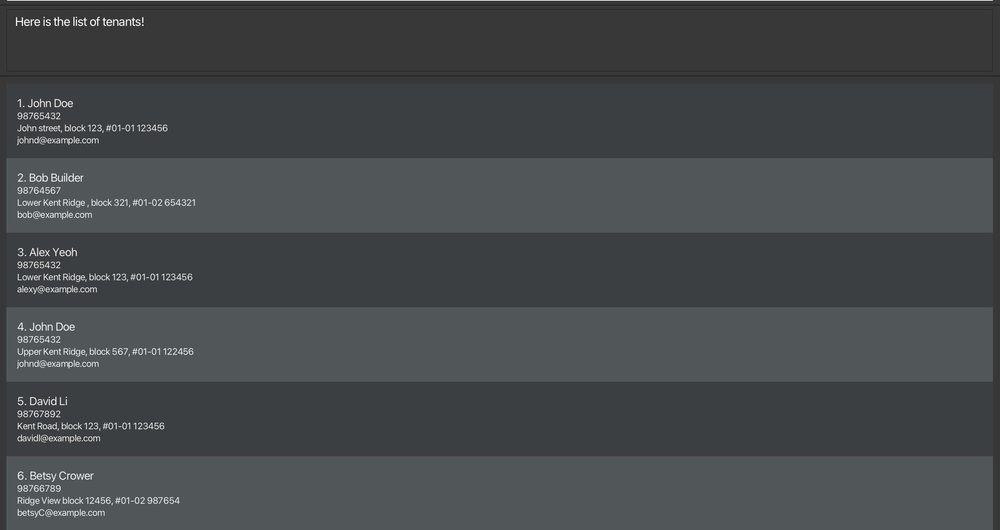

# TenantTrack User Guide

TenantTrack is a tool for landlords managing multiple rental properties. It helps keep track of tenant details efficiently. TenantTrack combines a command-line interface with a graphical interface, making it simple and intuitive to use.

## Table of Contents

- [TenantTrack User Guide](#tenanttrack-user-guide)
  - [Table of Contents](#table-of-contents)
  - [Quick start](#quick-start)
  - [Features](#features)
    - [Viewing help : `help`](#viewing-help--help)
    - [Adding a tenant: `add`](#adding-a-tenant-add)
    - [Archiving a tenant : `archive`](#archiving-a-tenant--archive)
    - [Listing all tenants : `list`](#listing-all-tenants--list)
    - [Editing a tenant: `edit`](#editing-a-tenant-edit)
    - [Locating tenants by name: `find`](#locating-tenants-by-name-find)
    - [Locating tenants by address: `filter`](#locating-tenants-by-address-filter)
    - [Deleting a tenant : `delete`](#deleting-a-tenant--delete)
    - [Clearing all entries : `clear`](#clearing-all-entries--clear)
    - [Exiting the program : `exit`](#exiting-the-program--exit)
    - [Saving the data](#saving-the-data)
    - [Editing the data file](#editing-the-data-file)
    - [Archiving data files `[coming in v2.0]`](#archiving-data-files-coming-in-v20)
  - [FAQ](#faq)
  - [Known issues](#known-issues)
  - [Command summary](#command-summary)

--------------------------------------------------------------------------------------------------------------------

## Quick start

1. Ensure you have Java `17` or above installed in your Computer. 
  **Mac users:** Ensure you have the precise JDK version prescribed [here](https://se-education.org/guides/tutorials/javaInstallationMac.html).

2. Download the latest `.jar` file from [here](https://github.com/AY2425S2-CS2103T-W12-1/tp/releases/).

3. Copy the file to the folder you want to use as the _home folder_ for your `TenantTrack`.

4. Open a command terminal, `cd` into the folder you put the jar file in, and use the `java -jar TenantTrack.jar` command to run the application. 
  A GUI similar to the below should appear in a few seconds. Note how the app contains some sample data. 
  

5. Type the command in the command box and press Enter to execute it. e.g. typing **`help`** and pressing Enter will open the help window. 
  Some example commands you can try:

- `list` : Lists all contacts.

- `add givenN/ John familyN/ Doe phone/98765432 email/johnd@example.com address/John street, block 123, #01-01 123456` : Adds a contact named `John Doe` to `TenantTrack`.

- `delete 3` : Deletes the 3rd contact shown in the current list.

- `clear` : Deletes all contacts.

- `exit` : Exits the app.

6. Refer to the [Features](#features) below for details of each command.

--------------------------------------------------------------------------------------------------------------------

## Features

**:information_source: Notes about the command format:** 

- Words in `UPPER_CASE` are the parameters to be supplied by the user. 
  e.g. in `add givenN/NAME`, `NAME` is a parameter which can be used as `add givenN/John Doe`.

- Items in square brackets are optional. 
  e.g `givenN/GIVEN_NAME[tag/TAG]` can be used as `givenN/John tag/friend` or as `givenN/John`.

- Items with `…`​ after them can be used multiple times including zero times. 
  e.g. `[tag/TAG]…​` can be used as `` (i.e. 0 times), `tag/friend`, `tag/friend tag/family` etc.

- Parameters can be in any order. 
  e.g. if the command specifies `givenN/GIVEN_NAME phone/PHONE_NUMBER`, `phone/PHONE_NUMBER givenN/GIVEN_NAME` is also acceptable.

- Extraneous parameters for commands that do not take in parameters (such as `help`, `list`, `exit` and `clear`) will be ignored. 
  e.g. if the command specifies `help 123`, it will be interpreted as `help`.

- If you are using a PDF version of this document, be careful when copying and pasting commands that span multiple lines as space characters surrounding line-breaks may be omitted when copied over to the application.

### Viewing help : `help`

Shows a message explaining how to access the help page.

Format: `help`

### Adding a tenant: `add`

Adds a tenant to the Tenant Track.

Format: `add givenN/GIVEN_NAME familyN/FAMILY_NAME phone/PHONE_NUMBER email/EMAIL address/ADDRESS [tag/TAG]…​`

:bulb: **Tip:**
A tenant can have any number of tags (including 0)

Examples:
- `add givenN/ John familyN/ Doe phone/98765432 email/johnd@example.com address/John street, block 123, #01-01 123456`
- `add givenN/ Sam familyN/ Wilson phone/87543213 email/samw@example.com address/Sam street, block 321, #02-04 4564231`

### Archiving a tenant : `archive`

Archive the specified tenant from the Tenant Track.

Format: `archive INDEX`

- Archive the tenant at the specified `INDEX`.
- The index refers to the index number shown in the displayed tenant list.
- The index **must be a positive integer** 1, 2, 3, …​

Examples:
- `list` followed by `archive 2` archives the 2nd tenant in the Tenant Track.
- `find Betsy` followed by `archive 1` archives the 1st tenant in the results of the `find` command.

### Listing all tenants : `list`

Shows a list of all tenants in the Tenant Track

Format: `list`

### Editing a tenant: `edit`

Updates the details of an existing tenant in the list.

Format:
`edit INDEX [givenN/GIVEN_NAME] [familyN/FAMILY_NAME] [phone/PHONE] [email/EMAIL] [address/ADDRESS] [tag/TAG]...`

Details:

INDEX refers to the number shown in the currently displayed tenant list. It must be a positive integer (e.g., 1, 2, 3, ...).

You must specify at least one field to update.

Specified fields will replace the tenant’s existing values.

When editing tags:

All existing tags will be cleared and replaced with the new ones.

To remove all tags, type tag/ without specifying any tag after it.

Examples:

`edit 1 phone/91234567 email/johndoe@example.com`
Updates the phone number and email of the first tenant.

`edit 2 givenN/Betsy familyN/Crower tag/`
Updates the name of the second tenant and clears all tags.

### Locating tenants by name: `find`

Finds tenants whose names contain any of the given keywords.

Format: `find KEYWORD [MORE_KEYWORDS]`

- The search is case-insensitive. e.g `hans` will match `Hans`
- The order of the keywords does not matter. e.g. `Hans Bo` will match `Bo Hans`
- Only the name is searched.
- Only full words will be matched e.g. `Han` will not match `Hans`
- Tenants matching at least one keyword will be returned (i.e. `OR` search).
  e.g. `Hans Bo` will return `Hans Gruber`, `Bo Yang`

Examples:
- `find John` returns `john` and `John Doe`
- `find alex david` returns `Alex Yeoh`, `David Li` 
  

### Locating tenants by address: `filter`

Filters the list for tenants whose address contains any of the given keywords.

Format: `find KEYWORD [MORE_KEYWORDS]`

- The search is case-insensitive. e.g `Lower Kent Ridge` will match `lower kent ridge`
- The order of the keywords does not matter. e.g. `Kent Ridge Lower` will match `Lower Kent Ridge`
- Only the address is searched.
- Only full words or postal codes will be matched e.g. `Kent` will not match `Ken` and ‘229’ will not match ‘229220’
- Tenants with addresses matching at least one keyword will be returned (i.e. `OR` search).
  e.g. `Lower Kent Ridge` will return `Lower Arab Street,`Kent Ridge`

Examples:
- `filter Kent Ridge` returns `Lower Kent Ridge` and `Upper Kent Ridge`
- `filter kent ridge` returns `Kent Road`, `Ridge View 
  

### Deleting a tenant : `delete`

Deletes the specified tenant from the Tenant Track.

Format: `delete INDEX`

- Deletes the tenant at the specified `INDEX`.
- The index refers to the index number shown in the displayed tenant list.
- The index **must be a positive integer** 1, 2, 3, …​

Examples:
- `list` followed by `delete 2` deletes the 2nd tenant in the Tenant Track.
- `find Betsy` followed by `delete 1` deletes the 1st tenant in the results of the `find` command.

### Clearing all entries : `clear`

Clears all entries from the Tenant Track.

Format: `clear`

### Exiting the program : `exit`

Exits the program.

Format: `exit`

### Saving the data

TenantTrack data is saved in the hard disk automatically after any command that changes the data. There is no need to save manually.

### Editing the data file

TenantTrack data is saved automatically as a JSON file `[JAR file location]/data/tenanttracker.json`. Advanced users are welcome to update data directly by editing that data file.

:exclamation: **Caution:**
If your changes to the data file makes its format invalid, TenantTrack will discard all data and start with an empty data file at the next run. Hence, it is recommended to take a backup of the file before editing it. 
Furthermore, certain edits can cause the TenantTrack to behave in unexpected ways (e.g., if a value entered is outside of the acceptable range). Therefore, edit the data file only if you are confident that you can update it correctly.

### Archiving data files `[coming in v2.0]`

_Details coming soon ..._

--------------------------------------------------------------------------------------------------------------------

## FAQ

**Q**: How do I transfer my data to another Computer? 
**A**: Install the app in the other computer and overwrite the empty data file it creates with the file that contains the data of your previous TenantTrack home folder.

--------------------------------------------------------------------------------------------------------------------

## Known issues

1. **When using multiple screens**, if you move the application to a secondary screen, and later switch to using only the primary screen, the GUI will open off-screen. The remedy is to delete the `preferences.json` file created by the application before running the application again.
2. **If you minimize the Help Window** and then run the `help` command (or use the `Help` menu, or the keyboard shortcut `F1`) again, the original Help Window will remain minimized, and no new Help Window will appear. The remedy is to manually restore the minimized Help Window.

--------------------------------------------------------------------------------------------------------------------

## Command summary

Action | Format | Examples
--------|--------|---------
**Add** | `add givenN/ GIVEN NAME familyN/ FAMILY NAME address/ ADDRESS phone/PHONE email/EMAIL` | `add givenN/ John familyN/ Doe address/ 21 Lower Kent Ridge Rd, 119077 phone/ 81923121 email/ johnd@example.com`
**Archive** | `archive INDEX` | `archive 1`
**Clear** | `clear` |
**Delete** | `delete INDEX` | `delete 3`
**Edit** | `edit INDEX [givenN/GIVEN_NAME] [familyN/FAMILY_NAME] [phone/PHONE_NUMBER] [email/EMAIL] [address/ADDRESS] [tag/TAG]…​` | `edit 2 givenN/James familyN/ Lee email/jameslee@example.com`
**Find** | `find KEYWORD [MORE_KEYWORDS]` | `find James Jake`
**Filter** | `filter KEYWORD [MORE_KEYWORDS]` | `filter Lower Kent Ridge`
**List** | `list` |
**Help** | `help` |
