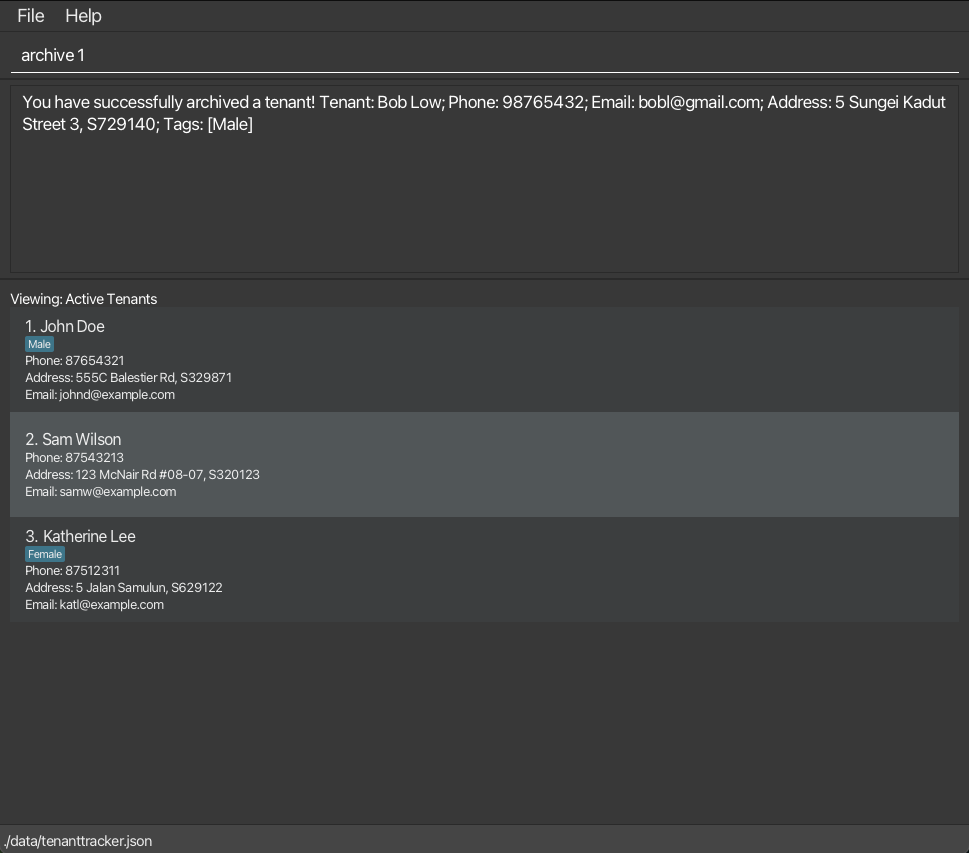
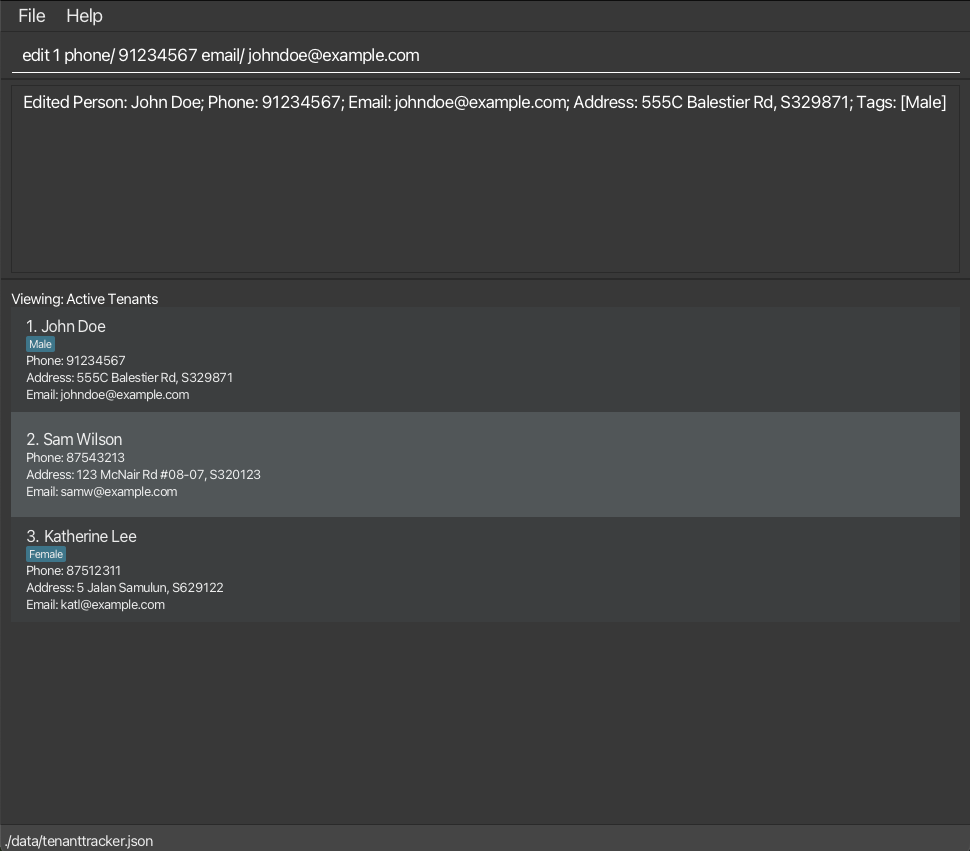
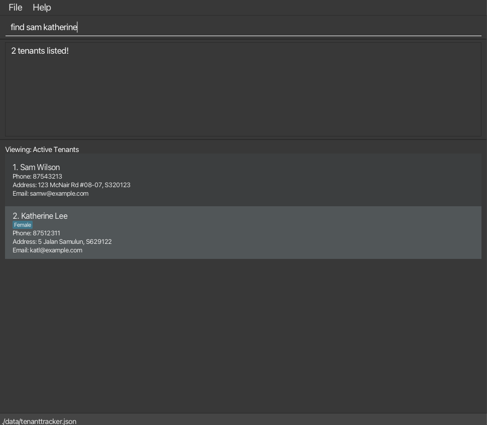
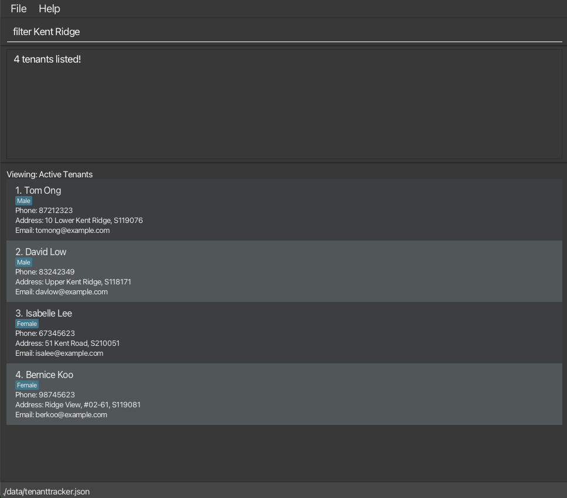
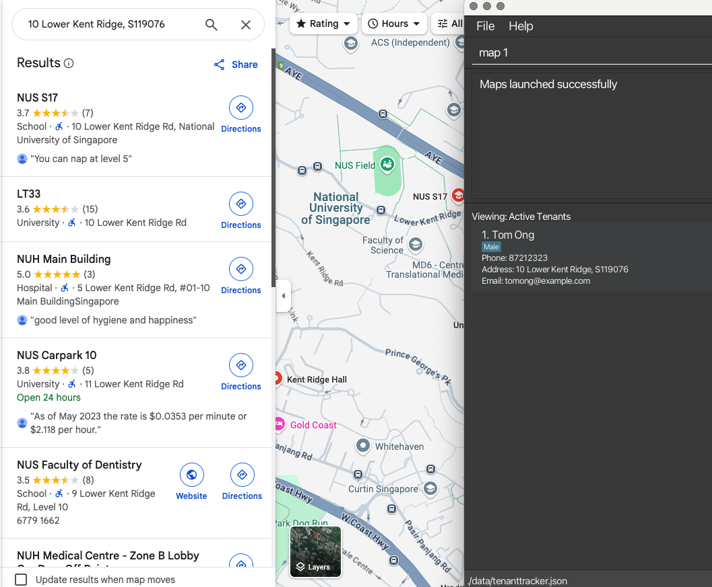
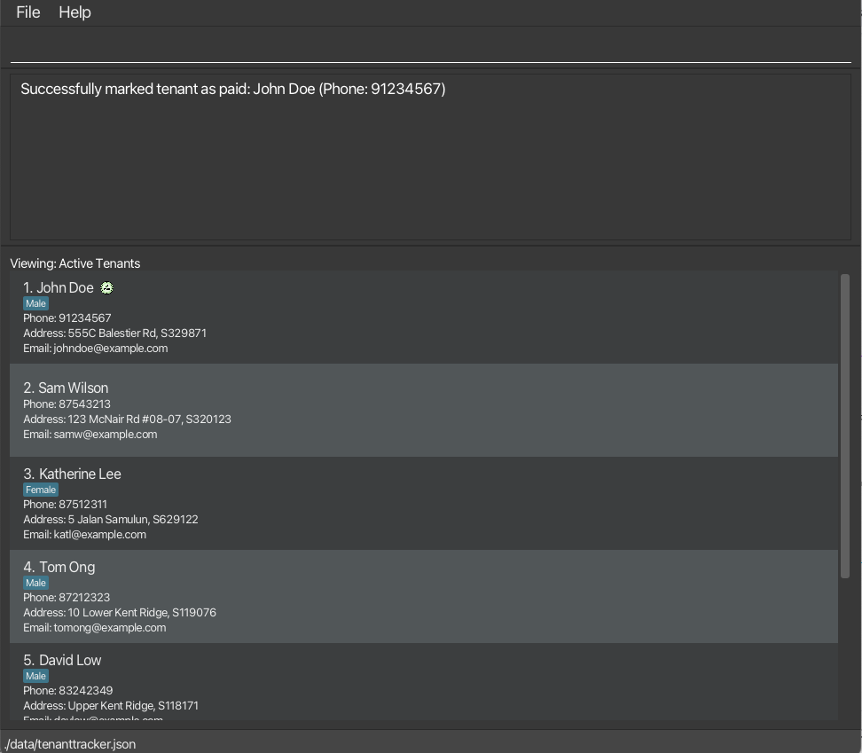
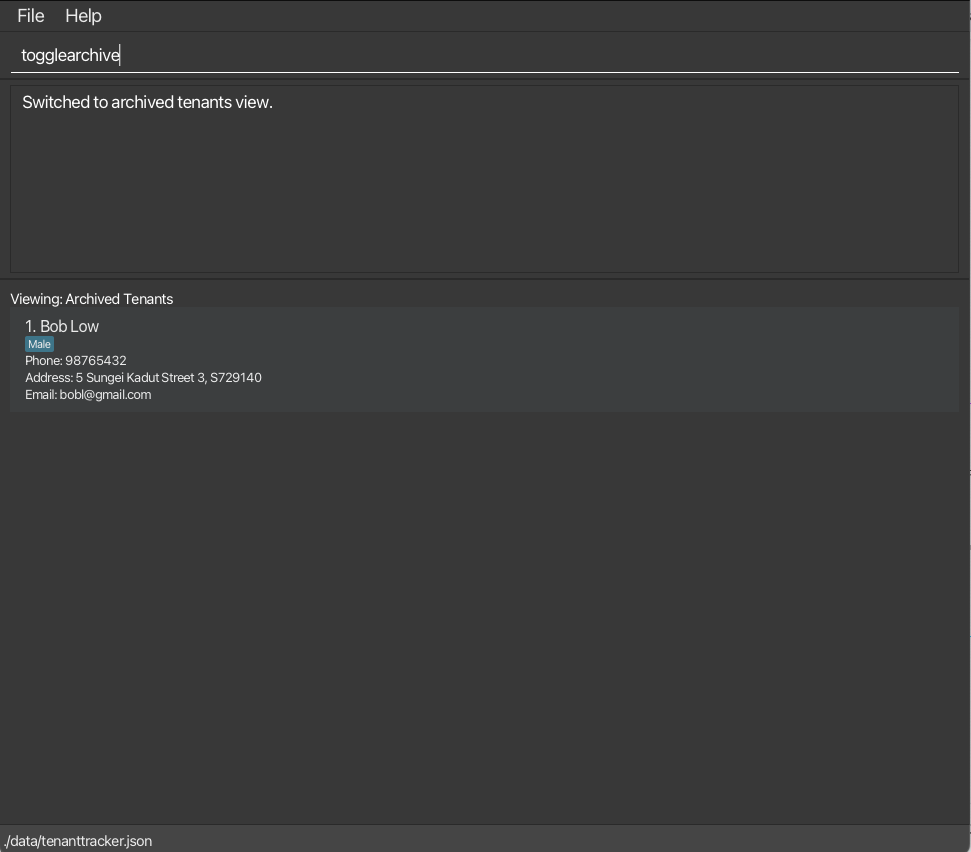

TenantTrack is a tool for landlords managing multiple rental properties. It helps keep track of tenant details
efficiently. TenantTrack combines a command-line interface with a graphical interface, making it simple and intuitive to
use.

* Table of Contents
{:toc}

--------------------------------------------------------------------------------------------------------------------

## Quick start

1. Ensure you have Java `17` or above installed in your Computer. 
   **Mac users:** Ensure you have the precise JDK version
   prescribed [here](https://se-education.org/guides/tutorials/javaInstallationMac.html).

1. Download the latest `.jar` file from [here](https://github.com/AY2425S2-CS2103T-W12-1/tp/releases/).

1. Copy the file to the folder you want to use as the _home folder_ for your `TenantTrack`.

1. Open a command terminal, `cd` into the folder you put the jar file in, and use the `java -jar TenantTrack.jar`
   command to run the application. 
   A GUI similar to the below should appear in a few seconds. Note how the app contains some sample data. 
   

1. Type the command in the command box and press **`Enter`** to execute it. e.g. typing `help` and pressing **`Enter`**
   will open the help window. 
   Some example commands you can try:

    * `list`: Lists all tenants.

    * `add givenN/ John familyN/ Doe phone/ 98765432 email/ johnd@example.com address/ John street, block 123, #01-01 S123456`:
      Adds a tenant named `John Doe`.

    * `delete 3`: Deletes the 3rd tenant shown in the current list.

    * `clear`: Deletes all tenants.

    * `exit`: Exits the app.

1. Refer to the [Features](#features) below for details of each command.

--------------------------------------------------------------------------------------------------------------------

## Features

**:information_source: Notes about the command format:** 

* Words in `UPPER_CASE` are the parameters to be supplied by the user. 
  For example, `add givenN/ GIVEN_NAME familyN/ FAMILY_NAME` can be used as `add givenN/ John familyN/ Doe`.

* Items in square brackets are optional. 
  For example, `givenN/ GIVEN_NAME [tag/TAG]` can be used as 
    * `givenN/ John tag/ friend`, OR
    * `givenN/ John`.

* Items with `…`​ after them can be used multiple times including zero times. 
  For example, `[tag/TAG]…​` can be used as 
    * ` ` (i.e. 0 times), OR
    * `tag/friend`, OR
    * `tag/friend tag/family`,
    * Etc.

* Parameters can be in any order. 
  For example, if the command specifies: `givenN/GIVEN_NAME phone/PHONE_NUMBER`, 
  it will also accept: `phone/PHONE_NUMBER givenN/GIVEN_NAME`.

* Unnecessary parameters for commands that do not take in parameters (such as `help`, `list`, `exit` and `clear`) will
  be ignored. 
  For example, if the command specifies `help 123`, it will be interpreted as `help`.

* If you are using a PDF version of this document, be careful when copying and pasting commands that span multiple lines
  as space characters surrounding line-breaks may be omitted when copied over to the application.

### Viewing help: `help`

Shows a message explaining how to access the help page.

Format:

<pre style="background-color: #eeeefe; padding: 10px; border-radius: 5px; font-family: monospace; font-size: 14px; white-space: pre-wrap; word-wrap: break-word;">
help
</pre>

### Adding a tenant: `add`

Adds a tenant to the Tenant Track.

Format:

<pre style="background-color: #eeeefe; padding: 10px; border-radius: 5px; font-family: monospace; font-size: 14px; white-space: pre-wrap; word-wrap: break-word;">
add givenN/ John familyN/ Doe phone/ 98765432 email/ johnd@example.com address/ John street, block 123, #01-01 S123456
</pre>

Details:

* Phone number must be a valid Singaporean 8-digit number.
* Emails must be a valid email, for example `address@domain.com`.
* Address must contain a valid 6-digit postcode within it. It must be a word of its own formatted as `SABXXXX` where:
  * `S` is the string `"S"` a prefix for standardisation.
  * `AB` is a postal zone, which can be any 2-digit number from `01-82`, excluding `74`
  * `XXXXXX` is any 4 digits.
  * One example valid address is: `NUS School of Computing, COM1, 13, Computing Dr, S117417`.
* Arguments/Prefixes should adhere to the specified order and format above.

:bulb: **Tip:**
A tenant can have any number of tags (including 0).

Examples:

* `add givenN/ John familyN/ Doe phone/ 98765432 email/ johnd@example.com address/ John street, block 123, #01-01 S123456`
* `add givenN/ Sam familyN/ Wilson phone/ 87543213 email/ samw@example.com address/ Sam street, block 321, #02-04 S456423`
  

### Archiving a tenant: `archive`

Archive the specified tenant from the Tenant Track.

Format:

<pre style="background-color: #eeeefe; padding: 10px; border-radius: 5px; font-family: monospace; font-size: 14px; white-space: pre-wrap; word-wrap: break-word;">
archive INDEX
</pre>

Details:

* Archive the tenant at the specified `INDEX`.
* `INDEX`index refers to the index number shown in the active tenant list.
* `INDEX` **must be a positive integer** 1, 2, 3, …​
* Archiving works on the active list from both the dsiplayed active list and the displayed archive list.

Examples:

* `list` followed by `archive 2` archives the 2nd tenant in the Tenant Track.
* `find Bob` followed by `archive 1` archives the 1st tenant in the results of the `find` command.
  

### Clearing all entries: `clear`

Clears all entries from the Tenant Track.

Format:

<pre style="background-color: #eeeefe; padding: 10px; border-radius: 5px; font-family: monospace; font-size: 14px; white-space: pre-wrap; word-wrap: break-word;">
clear
</pre>

### Deleting a tenant: `delete`

Deletes the specified tenant from the Tenant Track.

Format:

<pre style="background-color: #eeeefe; padding: 10px; border-radius: 5px; font-family: monospace; font-size: 14px; white-space: pre-wrap; word-wrap: break-word;">
delete INDEX
</pre>

Details:

* Deletes the tenant at the specified `INDEX`.
* `INDEX` index refers to the index number shown in the active tenant list.
* `INDEX` **must be a positive integer** 1, 2, 3, …​

Examples:

* `list` followed by `delete 2` deletes the 2nd tenant in Tenant Track.
* `find Betsy` followed by `delete 1` deletes the 1st tenant in the results of the `find` command.

### Editing a tenant: `edit`

Updates the details of an existing tenant in the list.

Format:

<pre style="background-color: #eeeefe; padding: 10px; border-radius: 5px; font-family: monospace; font-size: 14px; white-space: pre-wrap; word-wrap: break-word;">
edit INDEX [givenN/GIVEN_NAME familyN/FAMILY_NAME] [phone/PHONE] [email/EMAIL] [address/ADDRESS] [tag/TAG]...
</pre>

Details:

* Edit the tenant at the specified `INDEX`.
* `INDEX` index refers to the index number shown in the active tenant list.
* `INDEX` **must be a positive integer** 1, 2, 3, …​
* You must specify at least one field to update.
* Specified fields will replace the tenant’s existing values.
* `givenN/` and `familyN/` must both be present if editing name

:bulb: **On editing tags:** 

* All existing tags will be cleared and replaced with the new ones. 

* To remove all tags, type tag/ without specifying any tag after it. 

Examples:

* `edit 2 givenN/ Betsy familyN/ Crower tag/` updates the name of the second tenant and clears all tags.
* `edit 1 phone/ 91234567 email/ johndoe@example.com` updates the phone number and email of the first tenant.
  

### Locating tenants by name: `find`

Finds tenants whose names contain **ANY** of the given keywords.

Format:

<pre style="background-color: #eeeefe; padding: 10px; border-radius: 5px; font-family: monospace; font-size: 14px; white-space: pre-wrap; word-wrap: break-word;">
find KEYWORD [MORE_KEYWORDS]
</pre>

Details:

* The search is **NOT** case-sensitive. For example, `hans` will match `Hans`.
* The order of the keywords does not matter. For example, `Hans Bo` will match `Bo Hans`.
* Only the **name** in the active tenant list is searched.
* **Prefixes** of words will be matched. For example, a tenant with `Han` in his name will satisfy the command
`find Hans`. However, a tenant with `ans` in his name will **NOT** satisfy the command `find Hans`.
* Tenants matching at **least one keyword** will be returned (i.e. `OR` search). For example, `Hans Bo` will
  return `Hans Gruber`, `Bo Yang`.

Examples:

* `find John` returns `john` and `John Doe`.
* `find sam katherine` returns `Sam Wilson`, `Katherine Lee`. 
  

### Locating tenants by address: `filter`

Filters the list for tenants whose address contains any of the given keywords.

Format:

<pre style="background-color: #eeeefe; padding: 10px; border-radius: 5px; font-family: monospace; font-size: 14px; white-space: pre-wrap; word-wrap: break-word;">
filter KEYWORD [MORE_KEYWORDS]
</pre>

Details:

* The search is **NOT** case-sensitive. For example, `Lower Kent Ridge` will match `lower kent ridge`.
* The order of the keywords does not matter. For example, `Kent Ridge Lower` will match `Lower Kent Ridge`.
* Only the **address** in the active tenant list is searched.
* **Prefixes** of words or postal codes will be matched. For example, an address with `Kent` in it will satisfy the
command `filter Ken` and an address with `S229220` in it will satisfy the command `filter S229`.
However, an address with `ent` in it will **NOT** satisfy the command `filter Kent`.
* Tenants with addresses matching at least one keyword will be returned (i.e. `OR` search). For
  example, `Lower Kent Ridge` will return `Lower Arab Street`, `Kent Ridge`.

Examples:

* `filter Kent Ridge` return tenants with addresses `Lower Kent Ridge`,`Upper Kent Ridge`, `Kent Road`
  and `Ridge View`. 
  

:exclamation: **Caution:**
When filtering based on a single KEYWORD, take note to remove any trailing commas from the keyword.

### Listing all tenants: `list`

Shows a list of all tenants in the Tenant Track.

Format:

<pre style="background-color: #eeeefe; padding: 10px; border-radius: 5px; font-family: monospace; font-size: 14px; white-space: pre-wrap; word-wrap: break-word;">
list
</pre>

### Viewing address in Google Maps: `map`

Opens the specified tenant's address in Google Maps.

Format:

<pre style="background-color: #eeeefe; padding: 10px; border-radius: 5px; font-family: monospace; font-size: 14px; white-space: pre-wrap; word-wrap: break-word;">
map INDEX
</pre>

Details:

* Searches the tenant at the specified `INDEX`'s address.
* `INDEX` index refers to the index number shown in the active tenant list.
* `INDEX` **must be a positive integer** 1, 2, 3, …​
* `Map` command will input the address directly into the api call, Google Maps will handle which location is closest to
the exact given input.

Examples:

* `list` followed by `map 2` searches the 2nd tenant in Tenant Track's address in Google Maps.
* `find Tom` followed by `map 1` searches the 1st tenant in the results of the `find` command's address in Google
  Maps.
  

### Marking a tenant as paid: `paid`

Marks a tenant as paid with a paid icon based on phone number.

Format:

<pre style="background-color: #eeeefe; padding: 10px; border-radius: 5px; font-family: monospace; font-size: 14px; white-space: pre-wrap; word-wrap: break-word;">
paid PHONE
</pre>

Details:

* Searches the tenant with the specified phone number in the active tenant list.
* The phone number should be a valid Singaporean phone number exactly 8 digits long and starting with 6, 8 or 9.
* If the phone number does not belong to any tenant, an error message is returned.

Examples:

* `paid` followed by `91234567` adds a paid icon to the tenant with the phone number: `91234567`.
  

### Toggling between active and archive list: `togglearchive`

Changes the current list to either the displayed active list or the displayed archive list.

Format:

<pre style="background-color: #eeeefe; padding: 10px; border-radius: 5px; font-family: monospace; font-size: 14px; white-space: pre-wrap; word-wrap: break-word;">
togglearchive
</pre>

Details:

* Only the `unarchive` command works on the tenants in the archived list.

Examples:

* `togglearchive` switches to the archive list if active list was displayed before the command.

### Unarchiving a tenant: `unarchive`

Unarchive the specified tenant from the archive list of Tenant Track.

Format:

<pre style="background-color: #eeeefe; padding: 10px; border-radius: 5px; font-family: monospace; font-size: 14px; white-space: pre-wrap; word-wrap: break-word;">
unarchive INDEX
</pre>

Details:

* Unarchive the tenant at the specified `INDEX`.
* `INDEX`index refers to the index number in the archived tenant list.
* `INDEX` **must be a positive integer** 1, 2, 3, …​
* Unarchiving works on the archived list from both the displayed active list and the displayed archive list.

Examples:

* `togglearchive` from the active list, followed by `unarchive 2` unarchives the 2nd tenant in the archived Tenant Track.
* 'unarchive 2' from the archived list unarchives the 2nd tenant in the archived Tenant Track.
* 'unarchive 2' from the active list unarchives the 2nd tenant in the archived Tenant Track.

### Marking a tenant as not paid: `unpaid`

Marks a tenant as not paid based on phone number. The paid icon is removed from the tenant details.

Format:

<pre style="background-color: #eeeefe; padding: 10px; border-radius: 5px; font-family: monospace; font-size: 14px; white-space: pre-wrap; word-wrap: break-word;">
unpaid PHONE
</pre>

Details:

* Searches the tenant with the specified phone number in the active tenant list.
* The phone number should be a valid Singaporean phone number exactly 8 digits long and starting with 6, 8 or 9.
* The phone number should belong to a tenant that has paid.

Examples:

* `unpaid` followed by `87654321` removes the paid icon from the tenant with the phone number: `87654321`.

### Exiting the program: `exit`

Exits the program.

Format:

<pre style="background-color: #eeeefe; padding: 10px; border-radius: 5px; font-family: monospace; font-size: 14px; white-space: pre-wrap; word-wrap: break-word;">
exit
</pre>

### Saving the data

TenantTrack data is saved in the hard disk **automatically** after any command that changes the data. There is no need
to save manually.

### Editing the data file

TenantTrack data is saved automatically as a JSON file `[JAR file location]/data/tenanttracker.json`. Advanced users are
welcome to update data directly by editing that data file.

:exclamation: **Caution:**
If your changes to the data file makes its format invalid, TenantTrack will discard all data and start with an empty data file at the next run. Hence, it is recommended to take a backup of the file before editing it. 
Furthermore, certain edits can cause the TenantTrack to behave in unexpected ways (e.g., if a value entered is outside of the acceptable range). Therefore, edit the data file only if you are confident that you can update it correctly.

### Archiving data files `[coming in v2.0]`

_Details coming soon ..._

--------------------------------------------------------------------------------------------------------------------

## FAQ

**Q**: **How do I transfer my data to another Computer?** 
**A**: Install the app in the other computer and overwrite the empty data file it creates with the file that contains
the data of your previous TenantTrack home folder.

**Q**: **What should I do if I encounter an error while running the application?** 
**A**: Ensure that you have the correct version of Java installed. If the issue persists, check the error message for
details and refer to the [GitHub Issues page](https://github.com/AY2425S2-CS2103T-W12-1/tp/issues) to see if it has
already been reported. You can also create a new issue with a detailed description of the problem.

**Q**: **Can I use TenantTrack on operating systems other than macOS?** 
**A**: Yes, TenantTrack is compatible with Windows, macOS, and Linux, as long as Java 17 or above is installed.

**Q**: **Is there a way to recover deleted tenants?** 
**A**: No, once a tenant is deleted, the action cannot be undone. It is recommended to double-check before executing
the `delete` command. However, you can re-add the removed tenant using an `add` command.

**Q**: **Why does the application start with sample data?** 
**A**: The sample data is included to help new users understand how the application works. You can clear the sample data
using the `clear` command.

**Q**: **Can I run multiple instances of TenantTrack simultaneously?** 
**A**: It is not recommended to run multiple instances of TenantTrack using the same data file, as this may lead to data
corruption.

--------------------------------------------------------------------------------------------------------------------

## Known issues

1. **When using multiple screens**, if you move the application to a secondary screen, and later switch to using only
   the primary screen, the GUI will open off-screen. The remedy is to delete the `preferences.json` file created by the
   application before running the application again.
2. **If you minimize the Help Window** and then run the `help` command (or use the `Help` menu, or the keyboard shortcut
   **`F1`**) again, the original Help Window will remain minimized, and no new Help Window will appear. The remedy is to
   manually restore the minimized Help Window.

--------------------------------------------------------------------------------------------------------------------

## Command summary

 Action      | Format                                                                                                                  | Examples
-------------|-------------------------------------------------------------------------------------------------------------------------|------------------------------------------------------------------------------------------------------------------
 **Add**     | `add givenN/ GIVEN NAME familyN/ FAMILY NAME address/ ADDRESS phone/PHONE email/EMAIL`                                  | `add givenN/ John familyN/ Doe address/ 21 Lower Kent Ridge Rd, S119077 phone/ 81923121 email/ johnd@example.com`
 **Archive** | `archive INDEX`                                                                                                         | `archive 1`
 **Clear**   | `clear`                                                                                                                 |
 **Delete**  | `delete INDEX`                                                                                                          | `delete 3`
 **Edit**    | `edit INDEX [givenN/GIVEN_NAME] [familyN/FAMILY_NAME] [phone/PHONE_NUMBER] [email/EMAIL] [address/ADDRESS] [tag/TAG]…​` | `edit 2 givenN/ James familyN/ Lee email/ jameslee@example.com`
 **Find**    | `find KEYWORD [MORE_KEYWORDS]`                                                                                          | `find James Jake`
 **Filter**  | `filter KEYWORD [MORE_KEYWORDS]`                                                                                        | `filter Lower Kent Ridge`
 **List**    | `list`
 **Paid**    | `paid phone/PHONE`                                                                                                      | `paid 87654321`
 **ToggleArchive**  | `togglearchive`                                                                                                         |
 **Unarchive**  | `unarchive INDEX`                                                                                                       | `unarchive 1`
 **UnPaid**  | `unpaid phone/PHONE`                                                                                                    | `unpaid 87654321`
 **Help**    | `help`                                                                                                                  |
